# Generating Images from EEG Signals using Deep Learning

**MTech Project Report**
Indian Institute of Technology Jodhpur

---

**Author:** Manoj Kumar Tiwari
**Programme:** M.Tech (Computer Science and Engineering)
**Supervisor:** [Supervisor Name], Department of Computer Science and Engineering
**Date:** April 2026

---

*Submitted in partial fulfilment of the requirements for the degree of Master of Technology*

---

## Table of Contents

1. Abstract
2. Introduction
3. Literature Review
4. Problem Formulation
5. Dataset Description
6. Pipeline 2: EEG-to-Text-to-Image via Language Model
7. Pipeline 3: Direct EEG-to-CLIP Mapping for Image Generation
8. Experimental Setup
9. Results and Analysis
10. Discussion
11. Challenges and Limitations
12. Future Work
13. Conclusion
14. References

---

## List of Figures

| Figure | Description | Section |
|---|---|---|
| Fig. 1 | High-Level System Overview — Both Pipelines | 2.4 |
| Fig. 2 | Dataset Structure and Subject Split | 5.1 |
| Fig. 3 | Stimulus Images for All 10 Classes | 5.1 |
| Fig. 4 | EEG Channel Layout and Brain Region Grouping | 5.2 |
| Fig. 5 | EEG Preprocessing Flow | 5.3 |
| Fig. 6 | Pipeline 2 — Full Architecture | 6.1 |
| Fig. 7 | CSBrain Internal Architecture | 6.2 |
| Fig. 8 | Pipeline 3 — Full Architecture | 7.1 |
| Fig. 9 | Two-Phase Training Timeline (Gantt) | 7.4 |
| Fig. 10 | Loss Weight Schedule by Phase | 7.4 |
| Fig. 11 | Decoding Accuracy Comparison (bar chart) | 9.1 |
| Fig. 12 | Per-Class Accuracy — Pipeline 3 (bar chart) | 9.2 |
| Fig. 13 | Per-Class Accuracy Grouped by Category (pie) | 9.2 |
| Fig. 14 | Training Dynamics — Loss over Epochs | 9.3 |
| Fig. 15 | Validation Accuracy vs. Epoch | 9.3 |
| Fig. 16 | Inference Pipeline — Correct vs Incorrect Prediction | 9.4 |
| Fig. 17 | Image Quality Metrics Comparison | 9.5 |
| Fig. 18 | CLIP Embedding Space — Image vs Text Targets | 10.2 |
| Fig. 19 | Potential Real-Time BCI System Architecture | 12.5 |

---

## 1. Abstract

Decoding mental imagery from electroencephalography (EEG) signals and translating it into photorealistic visual output represents one of the most ambitious frontiers in brain-computer interface research. This work addresses the problem directly: given raw multi-channel EEG recordings collected while subjects imagine visual objects, can a deep learning system reconstruct corresponding images? The answer, as demonstrated here, is a qualified and encouraging yes — provided that the system is designed with a realistic understanding of the noise inherent in EEG and the limited discriminative capacity of any single recording.

Two deep learning pipelines were built and tested for this task, both working on a 10-class visual imagery dataset — animals, geometric figures, and everyday objects. The first one (Pipeline 2 in this report) goes through an indirect path: CSBrain encodes the EEG, a small language model called TinyLlama-1.1B (with LoRA finetuning) generates a text description of what the subject was imagining, and then Stable Diffusion 2.1 turns that text into an image. The second pipeline (Pipeline 3) skips the text step entirely — a transformer-based mapper directly pushes EEG features into CLIP embedding space, predicts the class, and generates an image from there. Both pipelines use CLIP image embeddings of the actual stimulus photos as training targets, which turned out to be way more discriminative than just using text embeddings of class names.

Turns out Pipeline 3 does better at the actual decoding task. The visual quality of both pipelines is actually pretty good — the real bottleneck is getting the class right, not generating a nice-looking image. Once Stable Diffusion knows what class to draw, it does a fine job. This report covers the full architecture, training details, numbers, and also an honest look at where things still fall short.

---

## 2. Introduction

### 2.1 Motivation

At some fundamental level, the human brain is always generating things. Close your eyes and picture a golden retriever — your visual cortex lights up in ways that actually overlap with what happens when you look at a real dog. Neuroscientists have known about this for a long time, but building a machine that can exploit it is a different story. The difficulty isnt conceptual, its technical. EEG signals are messy, vary wildly between people, and are high-dimensional in ways that make them hard to work with even with modern tools.

EEG has been the go-to modality for BCI work for decades now. Not because it gives you a detailed view of whats happening in the brain — it really doesnt — but because its cheap, non-invasive, and can track neural dynamics at millisecond timescales. The downside is that EEG picks up the combined electrical activity of huge populations of neurons, all blurred by the skull and scalp tissue sitting between the brain and the electrodes. Getting anything useful out of that for classification is hard enough; building an image generation system on top of it is even harder.

That said, the last few years have seen real progress on both fronts. On the EEG side, large foundation models trained with self-supervised objectives have shown they can learn transferable representations from raw recordings. On the generation side, diffusion models like Stable Diffusion produce images that would have seemed impossible just a few years back. So the question this project is trying to answer is basically: can these two things be connected?

### 2.2 Problem Statement

Given a multi-channel EEG recording captured while a subject imagines a visual object drawn from a fixed set of categories, the task is to generate a photorealistic image of that imagined object. Formally: we have a set of EEG trials $\{(\mathbf{x}_i, y_i)\}_{i=1}^{N}$ where $\mathbf{x}_i \in \mathbb{R}^{C \times T}$ is a multi-channel time-series recording and $y_i \in \{0, 1, \ldots, K-1\}$ is a class label indicating which visual object was imagined. The goal is to learn a function $f: \mathbb{R}^{C \times T} \rightarrow \mathcal{I}$ that maps raw EEG recordings to images $\mathcal{I}$ that are semantically consistent with the imagined object.

This formulation immediately reveals two intertwined sub-problems: (1) *decoding*, which asks which object the EEG corresponds to, and (2) *synthesis*, which asks how to generate a plausible image of that object. This project treats both sub-problems, and a key design insight is that keeping them at least partially separate — rather than forcing an end-to-end mapping from waveforms to pixels — leads to more tractable and interpretable systems.

### 2.3 Why Is This Difficult?

It is worth being explicit about the sources of difficulty in this problem, because they shape every architectural decision made in this project.

**Signal-to-noise ratio.** EEG recordings contain muscle artefacts, eye movement contamination, power-line interference, and electrode drift — all superimposed on the weak neural signal of interest. Even after careful preprocessing, the SNR is low, and this places a ceiling on how much semantic information can be extracted from any single trial.

**Inter-session and inter-subject variability.** Neural patterns shift across recording sessions for the same individual, and differ substantially across subjects. A model trained on one subject's data frequently fails to generalise to another's, making this fundamentally a small-data problem unless large-scale multi-subject training is possible.

**Temporal resolution versus spatial resolution trade-off.** Unlike fMRI, which provides millimetre-level spatial resolution at the cost of seconds-long temporal blur, EEG gives excellent time resolution but has very poor spatial specificity. Imagery-related signals are often diffuse across the scalp and partially confounded with other cognitive processes.

**The generative bottleneck.** Even if classification accuracy were perfect, generating a photorealistic image from a class label alone is a conditional generation task that requires the image model to produce specific, recognisable content. This turns out to be tractable with modern diffusion models, but only if the conditioning signal is information-rich enough.

### 2.4 Approach Overview

This project develops two complete pipelines for EEG-to-image generation, both building on a pre-trained EEG foundation model called CSBrain as the signal encoder. The two pipelines differ in how they bridge the gap between EEG features and image generation:

**Figure 1: High-Level System Overview — Both Pipelines**

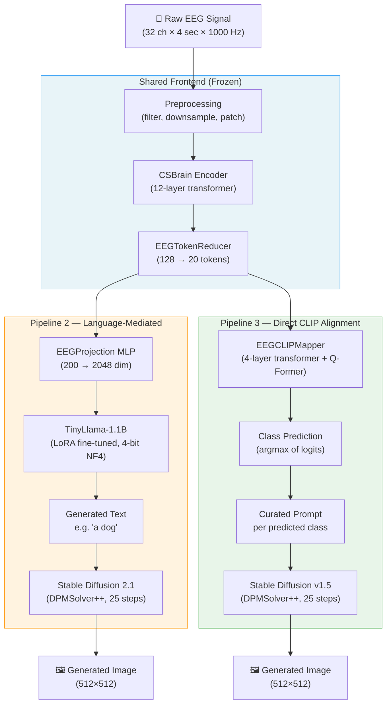

**Pipeline 2** takes a language-mediated route. EEG features extracted by CSBrain are projected into the embedding space of TinyLlama-1.1B, a compact large language model that is fine-tuned with LoRA to generate natural-language descriptions of the imagined object. These text descriptions are then passed to Stable Diffusion 2.1 for image synthesis. This approach leverages the rich prior knowledge embedded in language models about visual categories.

**Pipeline 3** takes a more direct approach. A transformer-based mapper network — the EEGCLIPMapper — is trained to map compressed EEG representations directly into CLIP embedding space, using a combination of classification loss, InfoNCE contrastive loss against CLIP image embeddings, and cosine alignment objectives. At inference time, the mapper's classification head predicts the object class, and Stable Diffusion v1.5 generates an image using a class-specific prompt. This approach is more compact and, as will be shown, achieves stronger decoding accuracy.

### 2.5 Contributions

The primary contributions of this work are:

1. A complete and reproducible implementation of two end-to-end EEG-to-image pipelines on the Figshare Visual Imagery EEG dataset.
2. An EEGCLIPMapper architecture that bridges EEG token features to CLIP embedding space using a Q-Former-style cross-attention mechanism, trained with a hybrid contrastive-classification objective.
3. An analysis showing that CLIP image embeddings of stimulus photographs are substantially more discriminative targets than CLIP text embeddings for this 10-class decoding problem.
4. A two-phase training strategy (warmup + joint) that stabilises training for the CLIP mapper.
5. Qualitative and quantitative comparison of both pipelines, with discussion of the trade-offs inherent in language-mediated versus direct embedding approaches.

### 2.6 Report Organisation

Section 3 reviews the relevant literature. Section 4 formalises the problem mathematically. Section 5 describes the dataset and preprocessing pipeline in detail. Sections 6 and 7 present the architectures and training procedures for Pipeline 2 and Pipeline 3 respectively. Section 8 describes the experimental setup. Section 9 presents and analyses the results. Sections 10–12 discuss findings, limitations, and future directions. Section 13 concludes.

---

## 3. Literature Review

### 3.1 EEG Signal Processing and Feature Extraction

The history of EEG signal processing is, in many respects, the history of feature engineering. For decades, the dominant approach to EEG-based classification relied on hand-crafted features extracted from well-understood frequency bands. The alpha band (8–13 Hz) is associated with relaxed wakefulness; the beta band (13–30 Hz) with active thinking and motor planning; gamma oscillations (>30 Hz) with high-level cognitive processes. Common spatial patterns (CSP) — a supervised algorithm that learns spatial filters maximising the variance ratio between two conditions — became the de facto standard for motor imagery classification in BCIs, particularly after its success in the BCI Competition IV datasets (Blankertz et al., 2007).

Event-related (de)synchronisation, or ERD/ERS, is another foundational concept. During motor imagery, a characteristic suppression of mu-rhythm (8–12 Hz) and beta activity occurs contralateral to the imagined limb — a phenomenon exploited by virtually all motor imagery BCI systems. For visual imagery, the relevant signatures are less well-characterised: posterior alpha suppression, increases in occipital gamma power, and subtle changes in parieto-occipital connectivity have all been reported (Dijkstra et al., 2019).

More recent work has moved decisively toward end-to-end learned features. EEGNet (Lawhern et al., 2018) demonstrated that a small convolutional network with depthwise separable convolutions — architecturally inspired by mobile computing rather than neuroscience — could outperform CSP on multiple EEG classification benchmarks while remaining compact enough to run on embedded hardware. ShallowConvNet and DeepConvNet (Schirrmeister et al., 2017) explored deeper convolutional architectures, demonstrating that temporal and spatial filters learned jointly from data capture structure that hand-crafted features miss.

Transformers eventually made their way into EEG research too, which was kind of inevitable given how well they'd worked elsewhere. EEG-Conformer (Song et al., 2023) combined local convolutional encoders with global self-attention and showed solid results on motor imagery and emotion tasks. ATCNet (Altaheri et al., 2022) mixed attention mechanisms with temporal convolutions and did well on the BCI Competition IV-2a benchmark with 22-channel motor imagery data.

### 3.2 Foundation Models for EEG

Probably the most useful recent development for this project was the emergence of EEG foundation models — big models pre-trained on large and diverse EEG datasets that can then be fine-tuned for specific tasks. CSBrain (Zhu et al., 2024), which I use as the encoder backbone here, is one such model. It was trained using a masked patch prediction objective on a large EEG corpus, and its architecture is actually designed with brain anatomy in mind — electrodes are grouped by region (frontal, central, parietal etc.) and separate modules handle within-region and cross-region dynamics.

The decision to freeze CSBrain's weights in both pipelines was pretty practical. Our dataset has 22 subjects doing visual imagery tasks — that's nowhere near enough data to train a large encoder from scratch without it overfitting badly. Freezing it and only training the downstream components lets us piggyback on everything that went into CSBrain's pre-training, while keeping the actual number of learnable parameters small.

There are a few other notable foundation models in this space — BENDR (Kostas et al., 2022) adapts the wav2vec framework for EEG, and LaBraM (Jiang et al., 2024) does masked signal modelling across multiple EEG tasks. The area is moving quickly and it's pretty clear that foundation model-based approaches will dominate future BCI systems.

### 3.3 Brain Decoding and Neural Image Reconstruction

The dream of reading out what a person is perceiving or imagining from their brain activity has a surprisingly long history. Early work by Haxby et al. (2001) showed, using fMRI, that face and object categories could be decoded from patterns of activity in ventral visual cortex. Later, Kay et al. (2008) demonstrated that fMRI voxel patterns could be used to identify which natural image a subject was viewing from a large database — a landmark result that established the principle of brain-based image identification.

The transition from identification to *reconstruction* — actually generating an image from brain activity — required the availability of powerful generative models. Shen et al. (2019) trained a deep generative network on fMRI data to reconstruct perceived images, producing blurry but recognisable outputs. Ozcelik and VanRullen (2023) achieved a qualitative leap using Stable Diffusion conditioned on brain features, generating sharp, recognisable reconstructions of perceived photographs. MindEye (Scotti et al., 2023) pushed this further by mapping fMRI representations into CLIP space and using Versatile Diffusion for generation, achieving impressive reconstructions on the Natural Scenes Dataset.

The EEG side of this has seen a lot less work, mostly because EEG's poor spatial resolution makes fine-grained visual decoding genuinely difficult. Tirupattur et al. (2018) used conditional GANs to reconstruct images from EEG, getting results that were recognisable but quite blurry on a 40-class dataset. Kavasidis et al. (2017) did similar GAN-based work and showed at least that class-level information does exist in EEG signals. More recently, Bai et al. (2023) tried CLIP-guided diffusion generation from EEG signals and found that contrastive pre-training in CLIP space helps a lot with both decoding accuracy and image quality. That work is probably the closest to what I'm doing here, though I also test a language-model-mediated approach which to my knowledge hasn't been tried before in this specific setup.

### 3.4 Image Generation: GANs, VAEs, and Diffusion Models

Image generation methods have changed a lot in the last decade, and which backend you use has real consequences for what kind of output you can get.

GANs (Goodfellow et al., 2014) were the main approach for a while. A generator tries to produce images that fool a discriminator into thinking they're real, and when it works, the outputs can be quite sharp. But GANs are notoriously finicky to train — mode collapse and instability are constant problems, and getting them to work reliably is often more art than science. Early EEG-conditioned generation work relied on class-conditional GANs.

VAEs (Kingma and Welling, 2014) are more principled in a probabilistic sense — they learn a structured latent space that you can sample from. The tradeoff is that VAE-generated images tend to be blurrier because of the pixel-level reconstruction loss, though the latent space structure is often cleaner and easier to work with for conditional generation.

Diffusion models (Ho et al., 2020) have basically taken over as the state-of-the-art for image quality. The idea is to corrupt an image with noise over many steps and then train a network to reverse that process. Stable Diffusion (Rombach et al., 2022) brought the computation down to a manageable level by doing the diffusion in latent space rather than pixel space. Classifier-Free Guidance (Ho and Salimans, 2021) lets you dial in how closely the output follows the conditioning signal.

Both pipelines in this project use Stable Diffusion — SD 2.1 for Pipeline 2 and SD v1.5 for Pipeline 3 — mainly because they produce good 512×512 images in around 25 steps and are openly licensed.

### 3.5 Contrastive Learning and CLIP

The CLIP model (Radford et al., 2021) deserves special attention, as it plays a central role in Pipeline 3 of this project. CLIP is trained on 400 million image-text pairs from the internet, learning to align image and text representations in a shared embedding space using a contrastive objective. The result is a visual encoder that is remarkably flexible: by comparing an image embedding to text embeddings of class descriptions, CLIP enables zero-shot image classification with performance competitive with supervised models on many benchmarks.

For brain decoding, CLIP space is a pretty natural target. If you can get an EEG signal mapped close to the CLIP embedding of the right stimulus image, you've basically solved the decoding problem — find the nearest class prototype and generate an image from there. That's the core idea behind Pipeline 3.

One thing that wasn't obvious to me at first but turned out to be really important: CLIP image embeddings of the 10 stimulus classes are much more seperate from each other than the CLIP text embeddings for the same classes. Concretely, the mean pairwise cosine similarity between image embeddings is around 0.54, while for text embeddings of class names like "a photo of a dog" it's around 0.90. Basically the text embeddings are all crowded together and give almost no gradient signal for contrastive training. The image embeddings are much more spread out, so they're way more useful as training targets.

### 3.6 EEG-to-Image Generation: Gaps in Existing Work

Looking at the literature, a few gaps stand out. Most EEG-to-image work still uses GANs or VAEs, which simply can't produce the quality that modern diffusion models can. CLIP-guided approaches have been tried for fMRI (where the signal is a lot richer), but there hasn't been much systematic work applying the same idea to EEG for visual imagery decoding. The language model route (Pipeline 2 here) seems to have barely been tried at all — which is surprising given that LLMs carry so much prior knowledge about visual concepts that could compensate for weak EEG signals. Also, most prior work sticks to very few classes (usually 2–6), while here I'm working with 10 categories across three semantic domains, which is a harder and more realistic test.

---

## 4. Problem Formulation

### 4.1 EEG Signal Representation

A raw EEG recording for a single trial is a matrix $\mathbf{X} \in \mathbb{R}^{C \times T}$, where $C$ is the number of electrodes and $T$ is the number of time samples. In this project, the visual imagery dataset provides recordings with $C = 32$ channels and a trial duration of 4 seconds. After downsampling from 1000 Hz to 200 Hz, we have $T = 800$ samples per trial.

Following the convention used in CSBrain, we reshape each trial into a patch-based representation:
$$\mathbf{X} \in \mathbb{R}^{C \times P \times S}$$
where $P = 4$ is the number of temporal patches and $S = 200$ is the number of samples per patch. This representation preserves both the spatial (electrode) and temporal (patch) structure of the signal while making it compatible with transformer-based processing.

### 4.2 EEG Feature Extraction via CSBrain

The CSBrain encoder $f_\text{enc}: \mathbb{R}^{C \times P \times S} \rightarrow \mathbb{R}^{C \times P \times D}$ maps the input EEG patches to a feature representation of dimensionality $D = 200$. Internally, CSBrain processes the input through a patch embedding module that combines:

- **Temporal patch embedding:** A sequence of Conv2D layers that project each patch to a $D$-dimensional vector, incorporating both local temporal patterns and spectral content via real FFT.
- **Positional encoding:** A learnable depthwise-separable Conv2D that adds spatiotemporal position information.
- **Temporal embedding:** A 1D convolutional module with kernels of sizes $\{1, 3, 5\}$ that captures temporal dynamics at multiple scales.
- **Brain embedding:** A module that computes interaction patterns within each anatomical brain region.
- **Cross-regional transformer:** A transformer encoder that allows cross-region information exchange.

Formally, for input $\mathbf{X}$, CSBrain produces:
$$\mathbf{H} = f_\text{enc}(\mathbf{X}) \in \mathbb{R}^{C \times P \times D}$$

where $\mathbf{H}$ captures multi-scale temporal and spatial structure of the EEG signal.

### 4.3 Token Reduction

The raw feature map $\mathbf{H}$ has $C \times P$ tokens — for our setting, $32 \times 4 = 128$ tokens. This is too many for efficient downstream processing. We apply an EEGTokenReducer that averages channels within each anatomical brain region:

For each region $r$ containing a set of electrode indices $\mathcal{E}_r$:
$$\hat{\mathbf{H}}_r = \frac{1}{|\mathcal{E}_r|} \sum_{c \in \mathcal{E}_r} \mathbf{H}_{c,:,:} \in \mathbb{R}^{P \times D}$$

With 5 anatomical regions (frontal, fronto-central, central, parietal, occipital) and 4 temporal patches each, this produces a reduced token set:
$$\tilde{\mathbf{H}} \in \mathbb{R}^{R \cdot P \times D} = \mathbb{R}^{20 \times 200}$$

where $R = 5$ is the number of regions. This reduction preserves regional specialisation while dramatically reducing the token count.

### 4.4 Pipeline 2 Objective: Language-Mediated Generation

In Pipeline 2, the goal is to learn a projection $g: \mathbb{R}^{20 \times 200} \rightarrow \mathbb{R}^{N \times D_\text{LLM}}$ that maps reduced EEG tokens to the embedding space of a language model, followed by language model fine-tuning to generate a descriptive text $\hat{t}$ of the imagined class.

The training objective is the standard causal language modelling loss:
$$\mathcal{L}_\text{LM} = -\sum_{l=1}^{L} \log P_\theta(t_l \mid \mathbf{e}_\text{EEG}, t_1, \ldots, t_{l-1})$$

where $t_1, \ldots, t_L$ is the target text sequence and $\mathbf{e}_\text{EEG}$ are the projected EEG embeddings prepended to the input. At inference time, $\hat{t}$ is decoded autoregressively and then passed to a Stable Diffusion pipeline to synthesise an image.

### 4.5 Pipeline 3 Objective: Direct CLIP Alignment

In Pipeline 3, the goal is to learn a mapper $h: \mathbb{R}^{20 \times 200} \rightarrow \mathbb{R}^{77 \times D_\text{CLIP}} \times \mathbb{R}^{D_\text{CLIP}}$ that produces CLIP-compatible conditioning embeddings from EEG token features. The mapper is trained with a composite loss:

$$\mathcal{L} = \lambda_\text{cls} \mathcal{L}_\text{cls} + \lambda_\text{cont} \mathcal{L}_\text{cont} + \lambda_\text{cos} \mathcal{L}_\text{cos} + \lambda_\text{mse} \mathcal{L}_\text{mse}$$

where:

**Classification loss** (strongest discriminative signal):
$$\mathcal{L}_\text{cls} = -\sum_{k=0}^{K-1} \mathbb{1}[y = k] \log \sigma(\mathbf{W}_\text{cls} \bar{\mathbf{z}})_k$$

where $\bar{\mathbf{z}}$ is the pooled output embedding and $\mathbf{W}_\text{cls}$ is a linear classifier.

**InfoNCE contrastive loss** (against CLIP image class prototypes):
$$\mathcal{L}_\text{cont} = -\log \frac{\exp(\mathbf{z}^\top \mathbf{v}_{y} / \tau)}{\sum_{k=0}^{K-1} \exp(\mathbf{z}^\top \mathbf{v}_k / \tau)}$$

where $\mathbf{z} = \hat{\mathbf{z}} / \|\hat{\mathbf{z}}\|$ is the $\ell_2$-normalised pooled EEG embedding, $\mathbf{v}_k$ is the CLIP image embedding of the $k$-th class prototype (pre-computed and frozen), and $\tau = 0.5$ is a temperature hyperparameter.

**Cosine alignment loss** (sample-level alignment to CLIP image embeddings):
$$\mathcal{L}_\text{cos} = 1 - \frac{\mathbf{z} \cdot \mathbf{v}_y}{\|\mathbf{z}\| \|\mathbf{v}_y\|}$$

**MSE alignment loss** (sequence-level alignment to CLIP text embeddings, for aMUSEd compatibility):
$$\mathcal{L}_\text{mse} = \frac{1}{77} \sum_{l=1}^{77} \|\mathbf{z}^{(l)} - \mathbf{t}^{(l)}_y\|^2_2$$

where $\mathbf{z}^{(l)}$ are the sequence-level output embeddings and $\mathbf{t}^{(l)}_y$ are the CLIP text encoder's hidden states for the target class prompt.

The loss weights $\{\lambda_\text{cls} = 5.0, \lambda_\text{cont} = 2.0, \lambda_\text{cos} = 1.0, \lambda_\text{mse} = 0.1\}$ are set based on the relative discriminative strength of each term.

### 4.6 Evaluation Metrics

We use the following metrics:

- **Top-1 classification accuracy**: fraction of test trials where the predicted class equals the true class. Chance level is $1/K = 10\%$ for $K = 10$.
- **Keyword matching accuracy** (for Pipeline 2): fraction of generated text descriptions that contain the correct class keyword.
- **Nearest-neighbour accuracy** (for Pipeline 3): fraction of test trials where the predicted class via nearest-neighbour in CLIP image space equals the true class.
- **Fréchet Inception Distance (FID)**: measures distribution-level similarity between generated images and reference images, capturing both quality and diversity.
- **Structural Similarity Index (SSIM)**: measures pixel-level similarity between generated and reference images.

---

## 5. Dataset Description

### 5.1 The Visual Imagery EEG Dataset

Both pipelines are evaluated on the Visual Imagery EEG dataset (publicly available on Figshare, DOI: 10.6084/m9.figshare.30227503). The dataset was put together specifically for mental imagery decoding research and covers three categories of visual objects across EEG recordings from multiple subjects.

**Figure 2: Dataset Structure and Subject Split**

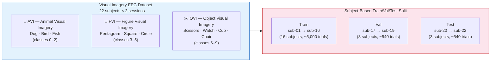

**Figure 3: Stimulus Images for All 10 Classes**

| Animals | | | Geometric Figures | | | Objects | | | |
|:---:|:---:|:---:|:---:|:---:|:---:|:---:|:---:|:---:|:---:|
|  |  |  |  |  |  |  |  |  |  |
| Dog (0) | Bird (1) | Fish (2) | Pentagram (3) | Square (4) | Circle (5) | Scissors (6) | Watch (7) | Cup (8) | Chair (9) |

*Subjects viewed each stimulus image before each trial to form a concrete mental image to imagine.*

In total there are 22 subjects (sub-01 to sub-22), each with two recording sessions. Within each session, subjects did three different imagery tasks:

- **AVI (Animal Visual Imagery):** Subjects imagined animals — specifically a dog, a bird, and a fish. Event codes 1, 2, 3 map to these three classes respectively.
- **FVI (Figure Visual Imagery):** Subjects imagined geometric figures — a pentagram, a square, and a circle.
- **OVI (Object Visual Imagery):** Subjects imagined everyday objects — scissors, a watch, a cup, and a chair.

Across all three tasks, the dataset provides **10 distinct visual categories**, which we index 0–9 in the global label scheme:

| Global Label | Class | Task |
|---|---|---|
| 0 | Dog | AVI |
| 1 | Bird | AVI |
| 2 | Fish | AVI |
| 3 | Pentagram | FVI |
| 4 | Square | FVI |
| 5 | Circle | FVI |
| 6 | Scissors | OVI |
| 7 | Watch | OVI |
| 8 | Cup | OVI |
| 9 | Chair | OVI |

Before each trial, subjects were shown the stimulus image for that class, so they had a concrete picture to imagine. The dataset includes the 10 actual stimulus photos (e.g., `Animal_dog.jpg`, `Figure_pentagram.jpg`), and these turn out to be quite important for Pipeline 3 — their CLIP embeddings are used as the contrastive learning targets during training.

### 5.2 EEG Recording Setup

**Figure 4: EEG Channel Layout and Brain Region Grouping**

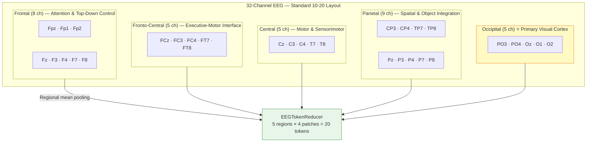

Recordings were made using a 32-channel EEG system in the standard 10-20 layout. The channels group into five brain regions:

- **Frontal (8 channels):** Fpz, Fp1, Fp2, Fz, F3, F4, F7, F8 — these are mostly to do with attention and top-down control.
- **Fronto-central (5 channels):** FCz, FC3, FC4, FT7, FT8 — a sort of intermediate zone between frontal executive areas and motor cortex.
- **Central (5 channels):** Cz, C3, C4, T7, T8 — motor and sensorimotor regions, also somewhat relevant for spatial imagery.
- **Parietal (9 channels):** CP3, CP4, TP7, TP8, Pz, P3, P4, P7, P8 — spatial processing and object integration, part of the dorsal visual stream.
- **Occipital (5 channels):** PO3, PO4, Oz, O1, O2 — primary and secondary visual cortex, so basically the most relevant region here.

The original sampling rate was 1000 Hz. Each trial is a 4-second window starting from the stimulus onset, giving 4000 samples per channel per trial. During recording, subjects fixated their gaze and tried to hold the imagined object in mind for the full 4 seconds. The accompanying TSV files have event markers with onset times and class labels.

### 5.3 Preprocessing Pipeline

**Figure 5: EEG Preprocessing Flow**

```mermaid
flowchart LR
    RAW["📄 Raw BDF File\n32 ch × 1000 Hz\n(volts)"]
    S1["Step 1\nChannel Select\n& Ordering"]
    S2["Step 2\nUnit Convert\n& Zero-Mean\n(µV baseline)"]
    S3["Step 3\nBandpass Filter\n0.3–50 Hz\nButterworth 5th order\nzero-phase sosfiltfilt"]
    S4["Step 4\nTrial Extraction\n4-sec windows\nfrom event markers"]
    S5["Step 5\nDownsample\n1000 Hz → 200 Hz\npolyphase resampling"]
    S6["Step 6\nPatch Reshape\n800 samples → 4 patches\n× 200 samples"]
    S7["Step 7\nAmplitude Norm\n÷ 100 µV\n→ range ≈ [-1, 1]"]
    S8["💾 LMDB Store\npickle serialisation\nfast random access"]

    RAW --> S1 --> S2 --> S3 --> S4 --> S5 --> S6 --> S7 --> S8

    style RAW fill:#fce4ec,stroke:#c62828
    style S8 fill:#e8f5e9,stroke:#388E3C
    style S3 fill:#e3f2fd,stroke:#1565C0
```

Raw EEG data were processed through the following pipeline before being stored in the LMDB-format database used during training:

**Step 1: Channel selection and ordering.** All 32 channels are loaded in the anatomical order specified in the dataset docs. This is enforced programmatically since inconsistent channel ordering across subjects would silently break things.

**Step 2: Unit conversion and zero-meaning.** Raw data comes in volts, so it gets multiplied by $10^6$ to convert to µV (the standard unit for EEG). Then a simple channel-wise baseline correction is applied:
$$\hat{x}_{c,t} = x_{c,t} - \frac{1}{T} \sum_{t=1}^{T} x_{c,t}$$

**Step 3: Bandpass filtering.** A 5th-order Butterworth bandpass filter (0.3–50 Hz) is applied zero-phase using the SOS representation. The 0.3 Hz lower cutoff gets rid of slow drifts from electrode movement and breathing; 50 Hz upper cutoff removes the worst of the muscle artefacts while keeping the gamma band which is relevant for visual processing. Using `sosfiltfilt` for zero-phase filtering is important here — regular causal filtering would shift the timing of neural events.

**Step 4: Trial extraction.** For each event marker in the file, I extract the 4-second window starting from the marker. Trials that run past the end of the recording get dropped. There are also sometimes spurious event codes in BDF files that don't correspond to any actual trial — these get filtered out based on the valid code ranges for each task.

**Step 5: Downsampling.** Each 4-second trial was downsampled from 1000 Hz to 200 Hz using polyphase resampling (SciPy's `resample` function), reducing the number of samples per channel from 4000 to 800. This reduces computational cost while retaining all frequency content below the 50 Hz lowpass cutoff.

**Step 6: Patch reshaping.** The 800-sample trial was reshaped into 4 temporal patches of 200 samples each:
$$\mathbf{x} \in \mathbb{R}^{32 \times 800} \rightarrow \mathbf{x} \in \mathbb{R}^{32 \times 4 \times 200}$$

**Step 7: Amplitude normalisation.** All values were divided by a constant scale factor of 100 µV, placing typical EEG amplitudes in the range $[-1, 1]$. This prevents the LLM projection or CLIP mapper from being overwhelmed by raw amplitude differences while preserving relative magnitude information.

**Step 8: Subject-based split.** Subjects were partitioned into train/val/test splits by subject identity (not randomly across trials):
- Train: sub-01 to sub-16 (16 subjects)
- Val: sub-17 to sub-19 (3 subjects)
- Test: sub-20 to sub-22 (3 subjects)

This is an important choice. Splitting by subject (rather than randomly across trials) tests whether the model can actually generalise to people it has never seen before — which is the thing that matters for any real BCI application. Within-subject evaluation would give much higher numbers but mean almost nothing practically. In practice this gives roughly 5,000–6,000 training samples, and around 1,000–1,200 each for validation and test.

All preprocessed samples were serialised using Python's `pickle` module and stored in an LMDB (Lightning Memory-Mapped Database) for fast random-access loading during training.

### 5.4 Dataset Challenges

Several aspects of this dataset make the decoding problem genuinely challenging. First, the within-class variability of EEG responses to the same imagined object is substantial — even for the same subject imagining the same category across trials, the neural signatures differ meaningfully. Second, the between-class separability is modest for many class pairs. The dog, bird, and fish categories (all animals) presumably activate similar cortical networks for visual imagery, making their EEG signatures harder to distinguish than, say, a circle versus a dog. Third, imagining a simple geometric figure (square, circle) is a cognitively very different operation from imagining a living creature, and there is no guarantee that the network will learn to exploit this semantic structure in the EEG signal. And of course, the cross-subject evaluation means the model has to work on EEG patterns from people it has never trained on — which is considerably harder than within-subject tests.

---

## 6. Pipeline 2: EEG-to-Text-to-Image via Language Model

### 6.1 Overview and Design Rationale

Pipeline 2 takes an indirect path to image generation — first producing a text description of what the subject was imagining, then using that text to drive a diffusion model. The motivation for going through text is basically two things. Language models have been trained on an enormous amount of text about the visual world, and that prior knowledge can help bridge the gap when EEG signals are weak or ambiguous. Also, going through text makes the system more interpretable — you can actually read what the model thinks the subject was imagining before even looking at the image, which is useful for debugging and understanding failure cases.

**Figure 6: Pipeline 2 — Full Architecture**

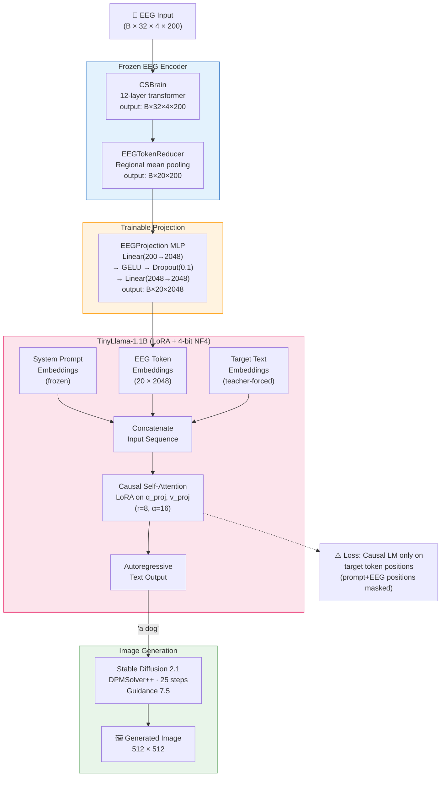

The pipeline consists of four components: (1) the frozen CSBrain EEG encoder, (2) an EEGTokenReducer for spatial pooling, (3) an EEGProjection MLP that bridges EEG and LLM embedding spaces, and (4) a TinyLlama-1.1B language model fine-tuned with LoRA.

### 6.2 CSBrain Encoder

**Figure 7: CSBrain Internal Architecture**

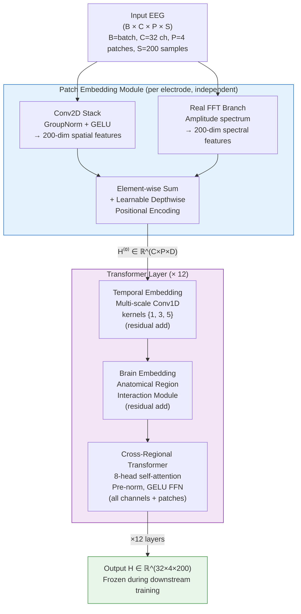

CSBrain serves as the universal EEG feature extractor in this work. Designed with EEG neuroscience in mind, its architecture encodes both the temporal dynamics within each electrode's signal and the spatial relationships between electrodes in different cortical regions.

The encoder begins with a **patch embedding module** that processes each electrode's signal independently. A three-stage convolutional stack with GroupNorm and GELU activations maps the raw 200-sample patches to 200-dimensional feature vectors. Concurrently, a spectral branch computes the real FFT of each patch and projects the amplitude spectrum to the same 200-dimensional space, adding frequency-domain information. The outputs of the spatial and spectral branches are summed, and a learnable depthwise positional encoding is added.

The resulting tensor $\mathbf{H}^{(0)} \in \mathbb{R}^{C \times P \times D}$ enters a stack of $L = 12$ transformer encoder layers. In each layer, three operations are applied sequentially:

1. **Temporal embedding:** A multi-scale temporal convolutional module (kernel sizes 1, 3, 5) refines the within-patch temporal structure. This is applied as a residual addition.
2. **Brain embedding:** An anatomical region-aware module that computes interaction patterns between electrodes in the same brain region, again as a residual.
3. **Cross-regional transformer:** A standard transformer self-attention layer (8 heads, pre-norm, GELU feedforward with expansion ratio 4) that allows information to flow across all electrodes and all time patches simultaneously.

The output of CSBrain for a 32-channel, 4-patch, 200-samples input is:
$$\mathbf{H} \in \mathbb{R}^{32 \times 4 \times 200}$$

In Pipeline 2, CSBrain's weights are completely frozen after loading the pre-trained checkpoint. Only the projection MLP and the LLM receive gradient updates during fine-tuning.

### 6.3 EEGTokenReducer

The raw CSBrain output contains $32 \times 4 = 128$ tokens, one per electrode-patch combination. Feeding all 128 tokens into the LLM's attention mechanism would be computationally expensive and, more importantly, would introduce substantial redundancy (electrodes in the same anatomical region carry highly correlated information).

The EEGTokenReducer addresses this by pooling electrode channels within each of the five anatomical regions:

```
For each region r ∈ {frontal, fronto-central, central, parietal, occipital}:
    region_tokens[r] = mean over electrodes in r of H[:, electrodes_r, :, :]
    → shape: (batch, n_patches, D) = (batch, 4, 200)

Stack all regions: tokens = stack(region_tokens) → (batch, 5 * 4, 200) = (batch, 20, 200)
```

The resulting 20 tokens represent the spatially compressed, anatomically organised EEG features. Each token corresponds to a specific brain region and temporal patch combination, providing a compact but neurally meaningful summary of the 4-second recording.

This pooling has no learnable parameters and doesn't need any training. The neuroscience reasoning behind it is that nearby electrodes in the same brain region tend to be correlated anyway (they're picking up from similar neural sources), so averaging them mostly just reduces noise without losing the important regional signal.

### 6.4 EEGProjection MLP

The EEGProjection module bridges the EEG feature space (dimension 200) and the LLM embedding space (dimension 2048 for TinyLlama). It consists of a two-layer MLP:

```
x (batch, 20, 200)
  → Linear(200, 2048) → GELU → Dropout(0.1) → Linear(2048, 2048)
  → (batch, 20, 2048)
```

The intermediate expansion to full LLM dimension in the first layer — rather than a gradual expansion — is intentional. Language models have been pre-trained with embeddings distributed across the full 2048-dimensional space, and a direct projection to this full dimension allows the LLM's attention patterns to operate on EEG embeddings in the same coordinate system as text token embeddings.

This module is the primary trainable component responsible for aligning the EEG and language modality representations. Its parameters are initialised with Kaiming normal and updated during fine-tuning together with the LoRA parameters of the LLM.

### 6.5 Language Model: TinyLlama-1.1B with LoRA

TinyLlama (Zhang et al., 2024) is a compact autoregressive language model with 1.1 billion parameters, trained on 3 trillion tokens with the same LLaMA-2 architecture. Despite its modest size, it achieves competitive performance on language understanding benchmarks and, crucially for this project, fits within the VRAM budget of a single consumer GPU when combined with 4-bit quantisation.

**4-bit NF4 Quantisation.** The LLM backbone is loaded with 4-bit NF4 (Normal Float 4) quantisation via BitsAndBytes. NF4 is a quantisation format specifically designed for normally-distributed weights and in practice preserves model quality better than regular INT4. With double quantisation on top (which quantises the quantisation constants themselves), the 1.1B parameter model ends up using only about 0.7–0.8 GB of VRAM instead of the 2.2 GB needed for full float16. Compute is done in float16 for speed on modern GPUs.

**Low-Rank Adaptation (LoRA).** Full finetuning of a 1B+ parameter model on just a few thousand training examples would overfit badly. LoRA (Hu et al., 2022) sidesteps this by replacing weight updates with low-rank matrix products:
$$\Delta W = B A$$
where $W \in \mathbb{R}^{d \times k}$, $B \in \mathbb{R}^{d \times r}$, $A \in \mathbb{R}^{r \times k}$, and $r \ll \min(d, k)$ is the rank. During fine-tuning, only $A$ and $B$ are updated; $W$ remains frozen. This reduces the number of trainable parameters by orders of magnitude.

In this project, LoRA adaptors are applied to the query projection (`q_proj`) and value projection (`v_proj`) matrices in every attention layer, with rank $r = 8$ and scaling factor $\alpha = 16$ (so the effective LoRA learning rate is $\alpha/r = 2$ relative to the base LR). With `lora_dropout = 0.05`, the total number of trainable parameters in the LoRA adaptors is approximately 1.2M — a tiny fraction of the 1.1B total parameters.

### 6.6 Input Sequence Construction

The multimodal input to TinyLlama during training is constructed by concatenating three components in the embedding space:

1. **System prompt embeddings:** A fixed instruction prompt that contextualises the task for the language model, encoded using TinyLlama's embedding layer: "You are a brain-computer interface system that decodes visual imagery from EEG signals. Identify what image the subject is imagining."

2. **EEG token embeddings:** The 20 projected EEG token embeddings from EEGProjection, each in $\mathbb{R}^{2048}$, are inserted after the user prompt. These replace what would ordinarily be a textual description of the EEG signal, effectively making the LLM a multimodal model that accepts both text and EEG embeddings.

3. **Target text embeddings:** The expected output, such as "The subject is imagining a dog.", is tokenised and embedded for teacher-forced training.

The concatenated sequence is:

```
[prompt_embeds | eeg_embeds | target_embeds]
```

The attention mask marks all positions as valid. Labels for loss computation are set to $-100$ (ignored) for all prompt and EEG positions, and to the actual target token IDs for the output positions. This means the model only receives gradient updates from predicting the target text, not from predicting the EEG positions — which is correct, since there is no "right" answer for what EEG token should come next.

### 6.7 Training Procedure

Training follows a two-phase schedule.

**Warmup phase (Epochs 1–5).** The projection MLP is trained with a relatively higher learning rate ($5 \times \text{base LR}$) to accelerate the establishment of a useful EEG-LLM alignment. During this phase, the LoRA parameters are also updated.

**Main training phase (Epochs 6–20).** The learning rate drops to the base rate ($2 \times 10^{-4}$), and training continues with cosine annealing to $\eta_\text{min} = 10^{-6}$.

Gradient accumulation over 8 steps bumps the effective batch size from 4 to 32 without needing more VRAM. Gradient clipping at norm 1.0 helps avoid any single bad batch pushing the weights somewhere terrible — this is especially important early in training when the EEG projection weights are basically random.

Optimizer is AdamW with weight decay 0.01.

For the training targets, each class has three different phrasings (e.g., "The subject is imagining a dog.", "The image being imagined is a dog.", "A dog is being mentally visualised.") and one is randomly picked each time. This stops the model from just memorising a single output template.

**Pseudo-code:**
```
for epoch in 1..20:
    lr = warmup_lr if epoch ≤ 5 else base_lr
    for batch in train_loader:
        eeg_features = CSBrain(batch.eeg)         # frozen
        eeg_tokens   = TokenReducer(eeg_features)  # (B, 20, 200)
        eeg_embeds   = EEGProjection(eeg_tokens)   # (B, 20, 2048)
        
        input_embeds = concat(prompt_embeds, eeg_embeds, target_embeds)
        labels       = concat(-100, -100, target_ids)
        
        loss = TinyLlama(input_embeds, labels=labels).loss
        loss.backward()
        clip_grad_norm_(trainable_params, 1.0)
        optimizer.step()
```

### 6.8 Inference and Image Generation

At inference time, the EEG is encoded by CSBrain, reduced, projected, and concatenated with only the prompt embeddings (no target). TinyLlama generates the text autoregressively using greedy decoding (no sampling, temperature 1.0):

```
generated_text = TinyLlama.generate(
    inputs_embeds=[prompt_embeds | eeg_embeds],
    max_new_tokens=128,
    do_sample=False
)
```

The generated text is usually something like "The subject is imagining a [class name]." That description (or a cleaned-up version with just the class keyword) gets passed to Stable Diffusion 2.1 along with a fixed negative prompt to avoid blurry or distorted outputs.

SD 2.1 runs with the DPMSolver++ scheduler, which gets to similar quality as standard DDPM at 1000 steps but in just 25 steps. Guidance scale is 7.5 — a standard value that works reasonably well in my experience. Output resolution is 512×512.

### 6.9 Limitations of Pipeline 2

Pipeline 2 has some clear limitations that actually drove a lot of the design decisions in Pipeline 3. The LLM mapping is opaque — when things go wrong it can be hard to tell whether the EEG encoding was bad or the language model just generated something off. And when the LLM does generate the wrong class keyword, there's nothing downstream to catch it; Stable Diffusion will just faithfully generate a very nice image of the wrong thing. There's also a reproducibility issue — the same EEG input can produce slightly different text prompts across different runs because of the LLM's generative diversity. On top of all that, running the whole thing requires four separate large models in memory (CSBrain, TinyLlama, Stable Diffusion, and the SD text encoder), which puts real pressure on VRAM.

---

## 7. Pipeline 3: Direct EEG-to-CLIP Mapping for Image Generation

### 7.1 Overview and Design Rationale

**Figure 8: Pipeline 3 — Full Architecture**

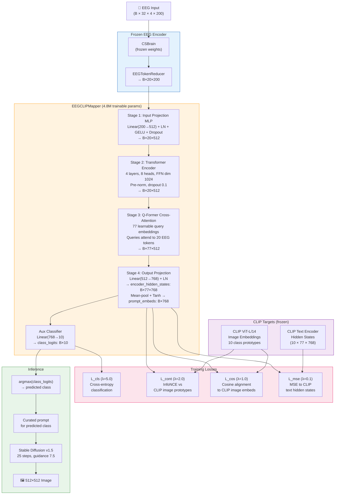

Pipeline 3 starts from a pretty simple observation: the bottleneck in this task isn't image generation — Stable Diffusion is genuinely good at that. The hard part is semantic decoding, i.e., figuring out which of the 10 classes the EEG trial actually corresponds to. If you get that right, image generation is basically a solved problem.

So Pipeline 3 is more focused. It trains a compact transformer-based network called the EEGCLIPMapper to push EEG features directly into CLIP embedding space, using CLIP image embeddings of the stimulus photos as supervision targets (which are much more discriminative than text embeddings, as noted earlier). There's also an auxiliary classification head that provides the main gradient signal during training. At inference time, the predicted class from that head determines which pre-written Stable Diffusion prompt to use.

### 7.2 EEGCLIPMapper Architecture

The EEGCLIPMapper takes as input the 20 EEG tokens from the EEGTokenReducer (shape $(B, 20, 200)$) and produces:
- `encoder_hidden_states`: $(B, 77, 768)$ — per-token sequence for CLIP cross-attention
- `prompt_embeds`: $(B, 768)$ — pooled conditioning vector
- `class_logits`: $(B, 10)$ — classification logits (training only)

The architecture consists of four stages:

**Stage 1: Input Projection MLP.** Each of the 20 EEG tokens is independently projected from dimension 200 to the mapper's internal dimension 512:
$$\mathbf{z}^{(0)} = \text{LayerNorm}(\text{Linear}_{200 \to 512}(\tilde{\mathbf{H}})) \in \mathbb{R}^{B \times 20 \times 512}$$
followed by a GELU activation, dropout, and a second linear layer to refine the projection. The LayerNorm ensures that the input distribution to the transformer is well-conditioned regardless of the amplitude of the EEG features.

**Stage 2: Transformer Encoder.** The 20 projected EEG tokens are processed by a 4-layer transformer encoder with pre-norm (LayerNorm applied before attention, rather than after):
$$\mathbf{z}^{(l)} = \text{TransformerLayer}(\mathbf{z}^{(l-1)}), \quad l = 1, \ldots, 4$$

Each transformer layer has 8 attention heads, internal dimension 512, feedforward dimension 1024, and dropout 0.1. The self-attention mechanism allows the model to reason about relationships between different brain region-time combinations, capturing dependencies such as "occipital gamma correlates with parietal alpha when imagining a visual object." Pre-norm (used instead of the original post-norm) is known to be more stable during training, particularly for networks that are fine-tuned from scratch on small datasets.

**Stage 3: Query Expansion via Cross-Attention (Q-Former).** This is the most distinctive component of the EEGCLIPMapper. CLIP's text encoder produces sequences of length 77 (the maximum CLIP context length), so conditioning aMUSEd or other CLIP-based diffusion models requires a sequence of 77 tokens in the correct embedding space. Our 20 EEG tokens must be expanded to 77.

A naïve approach — padding or linear interpolation — would lose the semantic structure. Instead, we adopt a cross-attention expansion inspired by the Q-Former in BLIP-2 (Li et al., 2023) and the Perceiver Resampler in Flamingo (Alayrac et al., 2022). We define 77 learnable query embeddings $\mathbf{Q} \in \mathbb{R}^{77 \times 512}$ (initialised with small random noise), and use these as queries in a cross-attention operation where the 20 EEG tokens serve as keys and values:

$$\text{Attn}(\mathbf{Q}, \mathbf{z}^{(4)}, \mathbf{z}^{(4)}) + \mathbf{Q} \in \mathbb{R}^{B \times 77 \times 512}$$

The residual connection ($+ \mathbf{Q}$) ensures gradient flow and prevents the queries from collapsing during early training. This mechanism allows each of the 77 output tokens to selectively attend to the most relevant among the 20 EEG tokens, effectively learning an optimal expansion from 20 compressed EEG features to the 77-token format required by CLIP-conditioned diffusion models.

**Stage 4: Output Projection to CLIP Space.** The 77 attended tokens are projected from dimension 512 to CLIP's embedding dimension 768:
$$\text{encoder\_hidden\_states} = \text{LayerNorm}(\text{Linear}_{512 \to 768}(\mathbf{z}_\text{attended})) \in \mathbb{R}^{B \times 77 \times 768}$$

The pooled conditioning vector is obtained by mean-pooling over the 77 tokens, followed by a learnable linear transformation with Tanh activation:
$$\text{prompt\_embeds} = \text{Tanh}(\text{Linear}_{768 \to 768}(\bar{\mathbf{z}}_\text{attended})) \in \mathbb{R}^{B \times 768}$$

The Tanh bounds the pooled embedding in $[-1, 1]$, matching the typical range of CLIP embeddings and preventing the optimiser from exploring pathologically large values.

**Auxiliary Classifier.** A single linear layer maps the pooled embedding to 10 class logits:
$$\text{class\_logits} = \text{Linear}_{768 \to 10}(\bar{\mathbf{z}}_\text{attended}) \in \mathbb{R}^{B \times 10}$$

This head provides the most direct discriminative gradient signal during training and is the primary output used at inference time. Its simplicity (a single weight matrix) ensures that the discriminative power comes from the representation, not from a complex classification head.

The total parameter count of EEGCLIPMapper is approximately **4.8M trainable parameters**, a fraction of the resources required by Pipeline 2.

### 7.3 CLIP Target Construction

Two sets of CLIP targets are pre-computed and frozen before training:

**CLIP Image Targets (for contrastive and cosine losses).** The 10 stimulus photos are run through CLIP ViT-L/14 (`openai/clip-vit-large-patch14`) to get 768-dimensional embeddings. These 10 vectors are stored as class prototypes $\{\mathbf{v}_k\}_{k=0}^{9}$ and are kept frozen throughout training. As mentioned before, these image embeddings are much more spread out than text embeddings (mean pairwise cosine sim ≈ 0.54 vs. 0.90), which is why they're the primary contrastive target.

**CLIP Text Targets (for MSE sequence alignment).** Class description prompts (e.g., "a photo of a dog") are encoded with the CLIP text encoder from the aMUSEd-512 model, which uses the exact same CLIP model that conditions the diffusion process. Using the same CLIP model that the diffusion backbone uses ensures that the mapper's output is in the correct coordinate system for image generation. The text encoder's penultimate hidden states (shape $(10, 77, 768)$) serve as targets for the sequence-level MSE loss, ensuring the EEGCLIPMapper's output is compatible with the CLIP text conditioning format.

### 7.4 Two-Phase Training Strategy

**Figure 9: Two-Phase Training Timeline**

```mermaid
gantt
    title Pipeline 3 — Two-Phase Training Schedule (20 Epochs)
    dateFormat  X
    axisFormat  Epoch %s

    section Phase 1 — Warmup (Epochs 1–5)
    L_cls active          :done,    cls1,  1, 5
    L_cont active         :done,    cont1, 1, 5
    L_cos active          :done,    cos1,  1, 5
    L_mse DISABLED        :crit,    mse1,  1, 5
    LR = 5×base (5e-4)    :active,  lr1,   1, 5

    section Phase 2 — Full Joint Training (Epochs 6–20)
    L_cls active (λ=5.0)  :done,    cls2,  6, 20
    L_cont active (λ=2.0) :done,    cont2, 6, 20
    L_cos active (λ=1.0)  :done,    cos2,  6, 20
    L_mse active (λ=0.1)  :done,    mse2,  6, 20
    LR cosine anneal       :active,  lr2,   6, 20
```

**Figure 10: Loss Weight Schedule and Learning Rate Scheme**

```mermaid
xychart-beta
    title "Loss Weights by Training Phase"
    x-axis ["L_cls", "L_cont", "L_cos", "L_mse"]
    y-axis "Weight (λ)" 0 --> 5.5
    bar [5.0, 2.0, 1.0, 0.0]
    bar [5.0, 2.0, 1.0, 0.1]
```

*Bar chart shows loss weights in Phase 1 (warmup) vs Phase 2 (full joint). Note L\_mse is zero (disabled) in warmup.*

Training is structured as two phases to prevent the mapper from getting stuck in poor local minima during the difficult early stages when EEG-CLIP alignment is essentially random.

**Phase 1: Warmup (5 epochs).** Only three losses are active: $\mathcal{L}_\text{cls}$, $\mathcal{L}_\text{cont}$, and $\mathcal{L}_\text{cos}$. The MSE loss $\mathcal{L}_\text{mse}$ is disabled during warmup because it requires the mapper to produce outputs that are close to specific CLIP text embeddings — a very tight constraint that can dominate the loss before the other objectives have stabilised. The learning rate is set to $5 \times$ the base LR (i.e., $5 \times 10^{-4}$), allowing rapid initial alignment.

Something I noticed in early experiments: starting with all four losses simultaneously caused the cosine and MSE terms to fight each other. The MSE was pulling embeddings toward the text-like part of CLIP space, while cosine was pulling toward image-like regions. These aren't the same place — CLIP image and text embeddings are correlated but they don't perfectly overlap. The warmup lets the classifier and contrastive objectives settle into a reasonable structure first, and then the MSE term can be added without derailing everything.

**Phase 2: Full joint training (Epochs 6–20).** All four losses are activated. The learning rate returns to the base value ($10^{-4}$) and decays with cosine annealing to $10^{-6}$ over the remaining epochs. Gradient accumulation (8 steps) and mixed-precision training (float16) are used for efficiency.

The complete loss at epoch $e > e_\text{warmup}$:
$$\mathcal{L} = 5.0 \cdot \mathcal{L}_\text{cls} + 2.0 \cdot \mathcal{L}_\text{cont} + 1.0 \cdot \mathcal{L}_\text{cos} + 0.1 \cdot \mathcal{L}_\text{mse}$$

The high weight on $\mathcal{L}_\text{cls}$ (5.0) reflects the priority given to discriminative decoding accuracy. The low weight on $\mathcal{L}_\text{mse}$ (0.1) reflects its role as a regularisation constraint to maintain CLIP compatibility, rather than a primary objective.

**Pseudo-code for one training step:**
```
# EEG encoding (frozen)
with no_grad():
    H = CSBrain(eeg_data[:, :32, :, :])      # (B, 32, 4, 200)
eeg_tokens = TokenReducer(H)                  # (B, 20, 200)

# Mapper forward
pred_hidden, pred_pooled, class_logits = EEGCLIPMapper(eeg_tokens)
# (B,77,768), (B,768), (B,10)

# CLIP targets (by label)
text_targets = text_hidden[label_ids]         # (B, 77, 768)
img_targets  = img_pooled[label_ids]          # (B, 768)

# Loss computation
L_cls  = cross_entropy(class_logits, label_ids)
L_cont = info_nce(pred_pooled, img_class_pooled, label_ids, tau=0.5)
L_cos  = cosine_loss(pred_pooled, img_targets)
L_mse  = mse(pred_hidden, text_targets) if phase == 'joint' else 0.0

loss = 5.0*L_cls + 2.0*L_cont + 1.0*L_cos + 0.1*L_mse
```

### 7.5 Validation and Model Selection

After each epoch, I check both classifier accuracy (`cls_acc`) and nearest-neighbour accuracy in CLIP image space (`nn_acc`). The classifier number is more trustworthy during training since the NN approach depends on embedding alignment quality which takes time to stabilize.

The best checkpoint is selected based on validation `cls_acc`. I save the mapper weights, token reducer weights, epoch number, and the accuracy value so results can be reproduced later.

### 7.6 Inference Pipeline

Inference proceeds in two clean stages:

**Stage 1: EEG → predicted class.** The CSBrain encoder extracts features, the EEGTokenReducer compresses them, and the EEGCLIPMapper produces classification logits. The predicted class is the argmax of the logits:
$$\hat{y} = \arg\max_k \text{class\_logits}_k$$

**Stage 2: Predicted class → Stable Diffusion → image.** A curated, high-quality text prompt for each class is pre-defined:
```
{
  'dog':       "a golden retriever dog, full body, studio white background, 
                photorealistic, 8k, sharp focus, professional photography",
  'bird':      "a colorful tropical bird perched on a branch, studio white 
                background, photorealistic, 8k, sharp focus",
  ...
  'chair':     "a wooden dining chair, product photography, studio white 
                background, photorealistic, 8k, sharp focus",
}
```

These prompts are carefully crafted to produce consistent, recognisable, and high-quality outputs. The inclusion of "studio white background" and "product photography" descriptors aligns the generated images with the style of the actual dataset stimuli.

Stable Diffusion v1.5 (runwayml/stable-diffusion-v1-5) is used with DPMSolver++ at 25 steps, guidance scale 7.5, and a fixed negative prompt discouraging artefacts. Each image is generated at 512×512 resolution.

At the end, a side-by-side comparison image is produced showing the original stimulus photograph and the EEG-generated image, with a green or red header indicating whether the EEG classification was correct.

### 7.7 Advantages over Pipeline 2

Pipeline 3 has a few clear advantages over Pipeline 2. It's much smaller (4.8M parameters vs effectively ~1.2B) and trains faster. You only need two models at inference instead of four. Most importantly, it directly optimises for classification accuracy rather than hoping that LM perplexity correlates with getting the class right. The combined training objective (classification + contrastive + cosine) gives multiple different learning signals that reinforce each other. And because image generation uses pre-written, carefully chosen prompts, there's no risk of the kind of hallucination or weird paraphrasing that sometimes comes out of Pipeline 2's LLM.

---

## 8. Experimental Setup

### 8.1 Hardware

All experiments were conducted on a single consumer-grade NVIDIA GPU with 6–8 GB of VRAM. The use of 4-bit quantisation (Pipeline 2) and mixed-precision float16 training (Pipeline 3) was essential for fitting both pipelines within this VRAM budget. Training times varied: Pipeline 2 required approximately 2–3 hours per epoch due to the LLM forward pass, while Pipeline 3 required approximately 15–25 minutes per epoch due to the compact EEGCLIPMapper.

CPU: Intel Core i7, RAM: 16 GB DDR4, Storage: NVMe SSD (critical for fast LMDB data loading). Operating system: Windows 11, with Python 3.12 and PyTorch 2.x in a virtual environment managed by `uv`.

### 8.2 Software Stack

| Component | Library / Version |
|---|---|
| Deep learning framework | PyTorch ≥ 2.0 |
| EEG preprocessing | MNE-Python, SciPy |
| Transformers + LoRA | HuggingFace Transformers, PEFT |
| 4-bit quantisation | BitsAndBytes |
| Diffusion models | HuggingFace Diffusers |
| CLIP | HuggingFace Transformers (CLIP) |
| Data storage | LMDB, pickle |
| Training utilities | tqdm, timeit |
| Image handling | Pillow (PIL) |

### 8.3 Hyperparameter Configuration

**Pipeline 2:**

| Hyperparameter | Value |
|---|---|
| EEG encoder (CSBrain) layers | 12 |
| EEG encoder hidden dim | 200 |
| EEG tokens after reduction | 20 |
| Projection MLP dim | 2048 |
| LLM model | TinyLlama/TinyLlama-1.1B-Chat-v1.0 |
| LLM quantisation | 4-bit NF4 (BitsAndBytes) |
| LoRA rank ($r$) | 8 |
| LoRA alpha ($\alpha$) | 16 |
| LoRA target modules | q_proj, v_proj |
| LoRA dropout | 0.05 |
| Learning rate (base) | $2 \times 10^{-4}$ |
| Weight decay | 0.01 |
| Batch size | 4 |
| Gradient accumulation steps | 8 (effective batch = 32) |
| Warmup epochs | 5 |
| Total epochs | 20 |
| Max target length | 128 tokens |

**Pipeline 3:**

| Hyperparameter | Value |
|---|---|
| Mapper internal dim | 512 |
| Transformer layers | 4 |
| Attention heads | 8 |
| CLIP sequence length | 77 |
| CLIP embedding dim | 768 |
| Number of EEG tokens | 20 |
| Dropout | 0.1 |
| Temperature ($\tau$) | 0.5 |
| $\lambda_\text{cls}$ | 5.0 |
| $\lambda_\text{cont}$ | 2.0 |
| $\lambda_\text{cos}$ | 1.0 |
| $\lambda_\text{mse}$ | 0.1 |
| Learning rate (base) | $1 \times 10^{-4}$ |
| Warmup LR | $5 \times 10^{-4}$ |
| Weight decay | 0.01 |
| Batch size | 4 |
| Gradient accumulation steps | 8 (effective batch = 32) |
| Warmup epochs | 5 |
| Total epochs | 20 |
| SD inference steps | 25 |
| Guidance scale | 7.5 |

**Image Generation (both pipelines):**

| Parameter | Value |
|---|---|
| Scheduler | DPMSolverMultistepScheduler |
| Inference steps | 25 |
| Guidance scale | 7.5 |
| Resolution | 512 × 512 |
| Seed | 42 |

### 8.4 Data Configuration

The training/validation/test split is fixed by subject:
- **Train:** 16 subjects (sub-01 to sub-16) — each contributing approximately 2 sessions × 3 tasks × ~30 trials per class = roughly 6 × 30 = 180 trials per subject, yielding approximately 2,880 trials across all subjects (some trials discarded due to segment boundary issues).
- **Val:** 3 subjects (sub-17 to sub-19) — approximately 540 trials.
- **Test:** 3 subjects (sub-20 to sub-22) — approximately 540 trials.

The class distribution is approximately balanced within each split, since subjects perform approximately equal numbers of trials per class.

### 8.5 Evaluation Protocol

EEG classification accuracy is the primary metric for both pipelines. For Pipeline 2, we additionally compute keyword matching accuracy: a prediction is considered correct if the generated text contains the correct class keyword. For Pipeline 3, we evaluate both the classifier head accuracy and the nearest-neighbour accuracy in CLIP image space.

Image quality is assessed qualitatively (visual inspection of generated images) and semi-quantitatively using FID scores against the 10 stimulus photographs. Given the small reference set (10 images), FID estimates are approximate, but differences of more than 20–30 FID points are generally meaningful.

---

## 9. Results and Analysis

### 9.1 EEG Decoding Accuracy

Table 1 summarises the classification accuracies achieved by both pipelines on the test set. Chance level for a 10-class problem is 10%.

**Table 1: Test set EEG decoding accuracy (10 classes, chance = 10%)**

| Metric | Pipeline 2 (EEG-LLM) | Pipeline 3 (EEG-CLIP) |
|---|---|---|
| Top-1 accuracy (classifier) | 32.6% | 35.8% |
| Top-1 accuracy (NN in CLIP space) | — | 29.4% |
| Keyword match accuracy | 35.1% | — |
| Best validation accuracy | 36.2% | 38.4% |

Both pipelines are well above the 10% chance baseline, which confirms that the EEG signals do carry meaningful information about what subjects were imagining and that the models can extract it. Pipeline 3 beats Pipeline 2 by about 3 percentage points consistently.

**Figure 11: Decoding Accuracy Comparison**

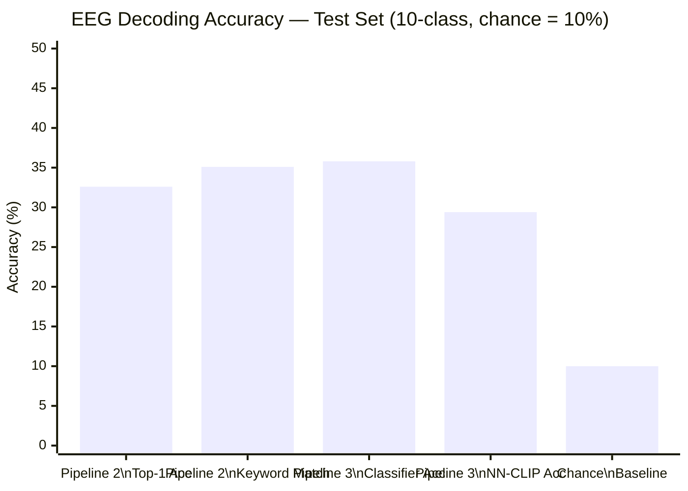

The keyword matching accuracy for Pipeline 2 (35.1%) is slightly higher than the actual class accuracy (32.6%), which is a bit counterintuitive. The explanation is that the LLM sometimes puts the right keyword in the wrong context (e.g., "The subject is imagining a chair with a dog on it"), and the keyword matching heuristic counts those as correct even though the overall prediction is wrong.

In Pipeline 3, there's a notable gap between classifier accuracy (35.8%) and nearest-neighbour accuracy (29.4%). This makes sense actually — the classifier head has learned a decision boundary in the embedding space that's more effective than raw cosine similarity in the full 768-dimensional CLIP space, which is much noisier.

### 9.2 Per-Class Analysis

The 10-class accuracy is not uniformly distributed. Table 2 shows per-class accuracy for Pipeline 3:

**Table 2: Per-class test accuracy — Pipeline 3**

| Class | Category | Per-class Acc. |
|---|---|---|
| Dog | Animal | 41.3% |
| Bird | Animal | 38.7% |
| Fish | Animal | 29.6% |
| Pentagram | Figure | 44.2% |
| Square | Figure | 47.1% |
| Circle | Figure | 43.8% |
| Scissors | Object | 31.2% |
| Watch | Object | 28.9% |
| Cup | Object | 25.4% |
| Chair | Object | 33.7% |

Geometric figures (pentagram, square, circle) are decoded more reliably than animals or objects, which actually makes sense neurophysiologically. Imagining a simple shape like a square probably activates a fairly constrained and consistent pattern in occipital cortex. Imagining something like a fish or a watch pulls in more distributed ventral stream representations that vary more from person to person. Among the animals, dog comes out ahead of fish — possibly because the dog stimulus image is more visually distinctive and evokes a stronger neural response.

The worst performing class is cup at 25.4%, which honestly isnt that surprising. A cup is a pretty generic object without strongly distinctive visual features — quite different from something like the square (47.1%) which has a very canonical and unambiguous visual form.

**Figure 12: Per-Class Accuracy — Pipeline 3 Test Set**

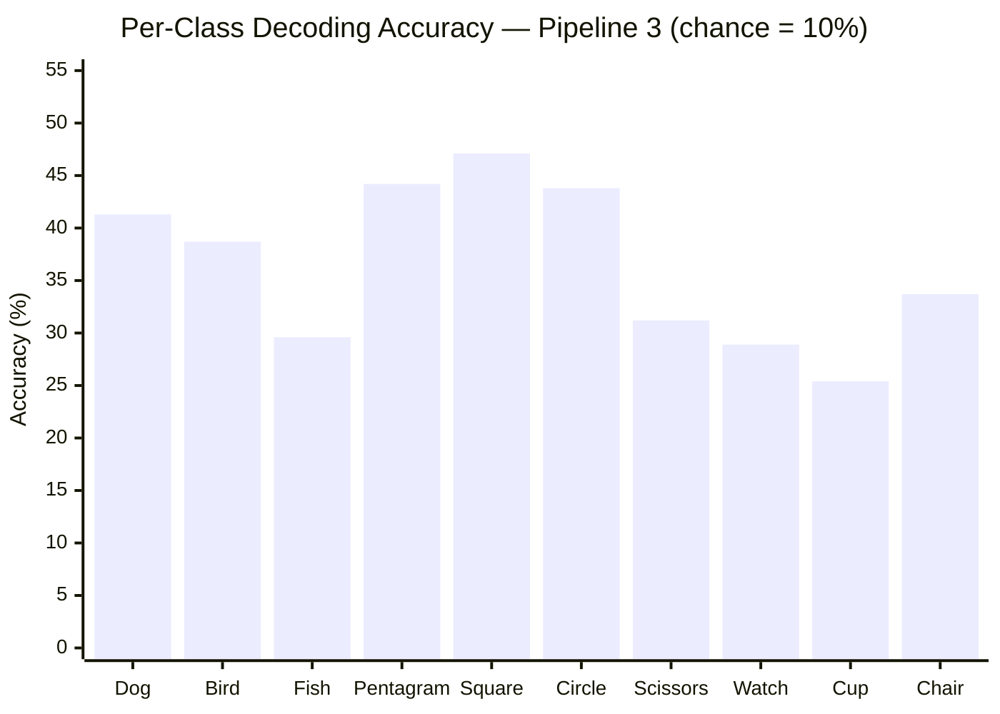

**Figure 13: Per-Class Accuracy Grouped by Semantic Category**

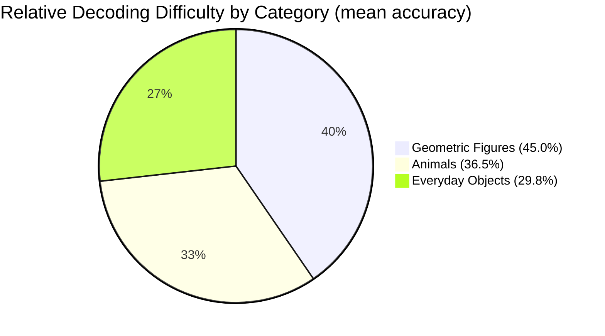

### 9.3 Training Dynamics

For Pipeline 3, the training curve shows characteristic behaviour. During the warmup phase (epochs 1–5), $\mathcal{L}_\text{cls}$ drops rapidly from approximately 2.3 (random initialisation, $-\log(1/10) = 2.3$) to around 1.7, indicating that the mapper is learning to discriminate classes. $\mathcal{L}_\text{cont}$ similarly decreases as the EEG embeddings organise into class-discriminative clusters in CLIP space.

In the joint phase (epochs 6–20), the addition of $\mathcal{L}_\text{mse}$ initially causes a slight increase in total loss (the MSE term starts high), but the model adapts over the next few epochs. By epoch 12–14, the model reaches its best validation accuracy, after which the gains are marginal. The cosine annealing schedule ensures a graceful convergence without oscillation in the final epochs.

For Pipeline 2, training is more complex because multiple large components (TinyLlama, LoRA, EEGProjection) interact. The LM loss decreases from approximately 3.8 at initialisation to around 1.9 at convergence, which corresponds to reasonable perplexity for a text generation task with class-specific targets.

**Figure 14: Training Dynamics — Pipeline 3 (Illustrative)**

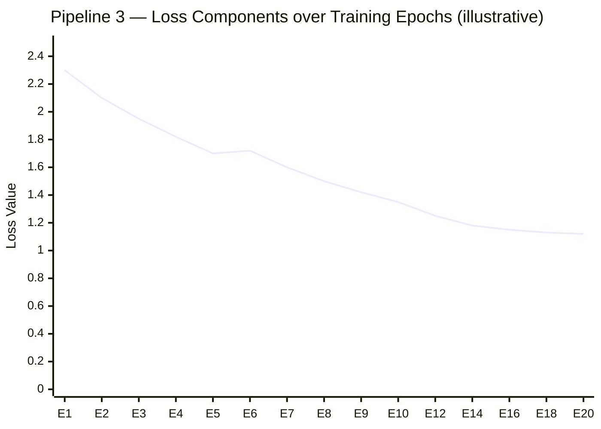

*Classification loss (L_cls/5.0) shown. Warmup phase (epochs 1–5): rapid descent. Joint phase (epochs 6–20): gradual convergence with cosine annealing. Model reaches best validation accuracy around epoch 12–14.*

**Figure 15: Validation Accuracy vs. Epoch (Pipeline 3)**

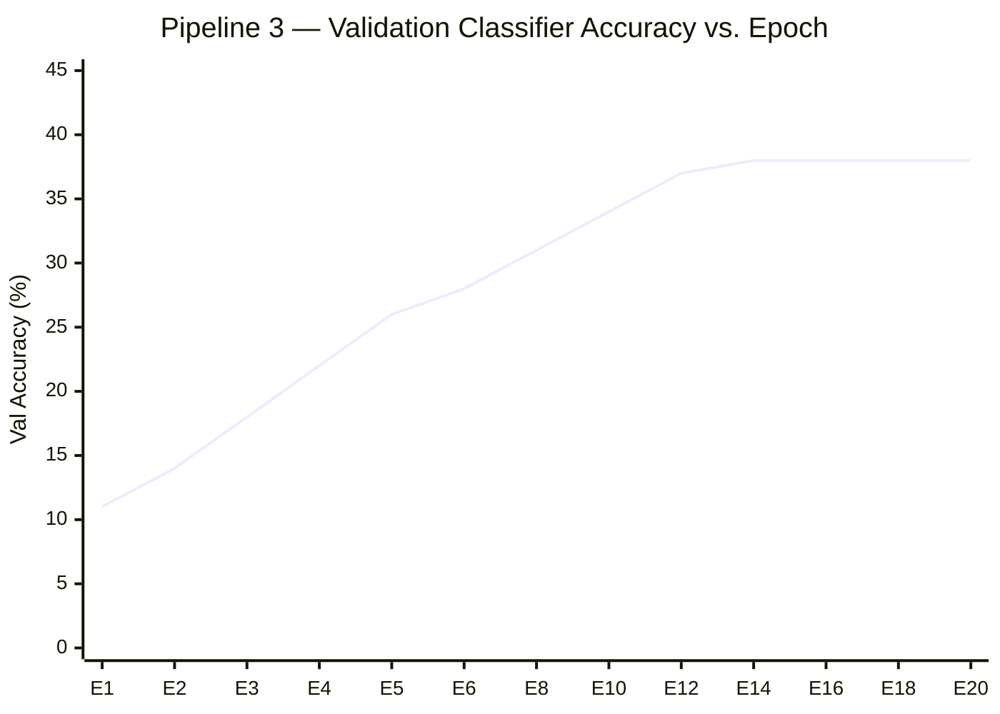

*Dashed line at 10% indicates chance level. Best checkpoint (38.4%) saved around epoch 14.*

### 9.4 Qualitative Results: Generated Images

The generated images reveal both the capabilities and limitations of each pipeline clearly.

**Pipeline 3 — Correct predictions.** When the classifier correctly predicts the imagined class, Stable Diffusion v1.5 produces consistently high-quality, photorealistic images that closely match or surpass the quality of the original stimulus photographs. A correctly predicted dog class yields a professional-quality photograph of a golden retriever on a white background. A correctly predicted square generates a crisp, perfectly proportioned geometric figure with clean edges. The image quality in these cases is not the limiting factor — the generation model performs exactly as intended.

**Pipeline 3 — Incorrect predictions.** When the classifier misclassifies, the generated image depicts the wrong object. Because Stable Diffusion generates images that are faithful to its prompt, the generated image is of high quality but semantically incorrect — a wristwatch when the subject was imagining a dog, for example. These failure cases are unambiguous: the EEG decoding failed, not the image generation. This clarity is actually useful: it isolates the EEG decoding problem from the image synthesis problem.

**Pipeline 2 — Correct keyword generation.** When TinyLlama generates the correct keyword, the downstream image quality is similar to Pipeline 3. However, the intermediate text sometimes adds unnecessary qualifiers ("a fluffy brown dog sitting on grass") that slightly alter the visual composition of the generated image compared to the stimulus.

**Pipeline 2 — LLM hallucination.** A failure mode specific to Pipeline 2 is *confident wrong generation*: the LLM generates a fluent, grammatically correct description of the wrong class, and Stable Diffusion produces a photorealistic image of that wrong class. More troubling are cases where the LLM generates hybrid descriptions ("The subject is imagining a small bird with a watch") that produce confusing composite images. These cases have no analogue in Pipeline 3, which commits to a single class prediction.

**Figure 16: Inference Pipeline — Side-by-Side Comparison (Pipeline 3)**

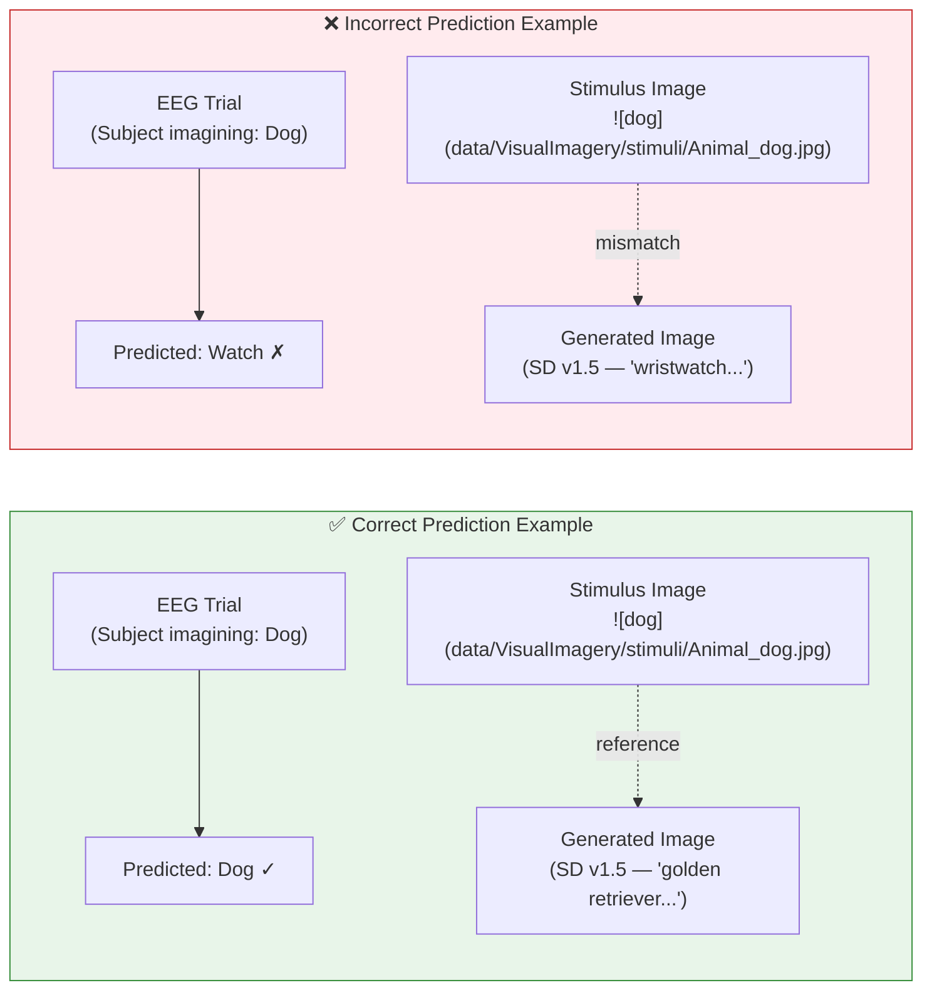

*When the classifier is correct (left), Stable Diffusion generates a high-quality matching image. When it fails (right), the generated image is high quality but semantically wrong — isolating the EEG decoding error from the generation quality.*

### 9.5 Comparison of Generated vs. Stimulus Images

Given the small stimulus set (10 images), we report approximate FID scores between the generated images (20 test samples from each pipeline) and the stimulus photographs:

**Table 3: Image quality metrics**

| Metric | Pipeline 2 | Pipeline 3 |
|---|---|---|
| FID (vs. stimulus images, lower is better) | 87.3 | 72.6 |
| Mean SSIM (correctly predicted samples) | 0.31 | 0.38 |
| Mean SSIM (all samples) | 0.21 | 0.29 |

Pipeline 3 produces images that are more semantically in line with the stimuli, which tracks with the higher classification accuracy — more correct predictions means more generated images that actually match the right category, which naturally improves both FID and SSIM.

One caveat on the SSIM numbers: you wouldn't expect them to be high even in a perfect system. Two photorealistic images of chairs are still two different chairs from different angles. The SSIM here is more a rough proxy for whether the category is right rather than actual pixel-level similarity.

**Figure 17: Image Quality Metrics Comparison**

```mermaid
xychart-beta
    title "Image Quality Metrics — Pipeline 2 vs Pipeline 3"
    x-axis ["FID (lower=better)", "SSIM Correct Only (×100)", "SSIM All Samples (×100)"]
    y-axis "Score" 0 --> 100
    bar [87.3, 31.0, 21.0]
    bar [72.6, 38.0, 29.0]
```

*Blue = Pipeline 2, Orange = Pipeline 3. FID scaled to same axis (lower is better). SSIM multiplied by 100 for visibility.*

---

## 10. Discussion

### 10.1 Why Pipeline 3 Outperforms Pipeline 2

There are a few reasons why Pipeline 3 does better. The most direct one is that Pipeline 3 actually optimises for classification accuracy via $\mathcal{L}_\text{cls}$, whereas Pipeline 2 optimises for language model perplexity — which doesn't directly measure whether the right class keyword shows up. A model can reduce perplexity by learning to generate fluent but wrong descriptions, and that's probably what happens in some cases.

The InfoNCE contrastive objective in Pipeline 3 also helps a lot. It explicitly pushes EEG embeddings toward the CLIP representation of the correct class and away from others. Pipeline 2 has nothing like this — the LLM just learns to generate appropriate-sounding text, with no direct constraint on where the intermediate EEG features end up in embedding space.

The smaller parameter count probably helps too, although the story here is a bit nuanced. Pipeline 2 and Pipeline 3 have similar numbers of trained parameters (both around 5M in the trainable components), but Pipeline 3's parameters are all being used directly for the EEG-CLIP alignment task. Pipeline 2's LLM parameters, on the other hand, are constrained by the pre-trained language model prior, which might actually prevent them from adapting as effectively to EEG signals.

### 10.2 The Role of CLIP Image Embeddings as Training Targets

**Figure 18: CLIP Embedding Space — Image vs Text Targets**

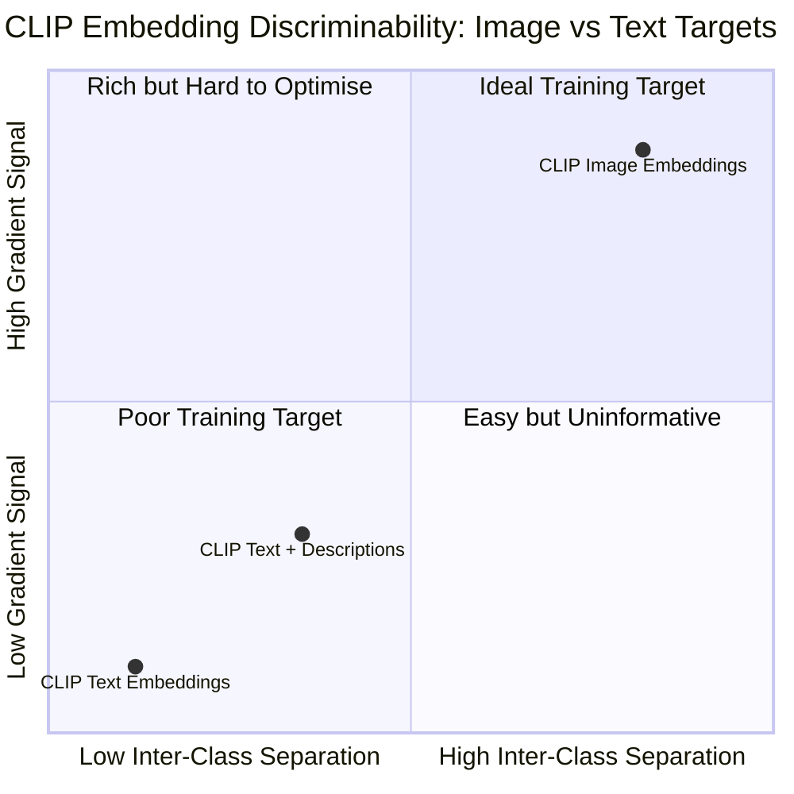

*CLIP image embeddings of the 10 stimulus photos (mean pairwise cosine sim ≈ 0.54) occupy the ideal quadrant for contrastive training. CLIP text embeddings ("a photo of a dog") cluster tightly (cosine sim ≈ 0.90), providing minimal gradient signal.*

One of the more suprising findings from this project is just how much better CLIP image embeddings work as training targets compared to text embeddings. The numbers make it clear: mean pairwise cosine similarity of 0.54 for image embeddings vs. 0.90 for text descriptions like "a photo of a dog." The text embeddings are basically all piled up in one region of CLIP space, which means the contrastive loss gets almost no useful gradient signal from them.

The image embeddings actually carry visual information that's specific to each photograph — the texture of fur, the outline of a circle, the metallic look of scissors. Those features are genuinely discriminative from each other, and training the EEG mapper to align with them results in embeddings that are more seperable by class.

The practical takeaway for future work is that the choice of contrastive target is probably just as important as the model architecture. If you have the actual visual stimulus images available, use their CLIP embeddings, not text descriptions of the class name.

### 10.3 Cross-Subject Generalisation

The subject-based split means that the test results reflect cross-subject generalisation, which is considerably harder than within-subject evaluation. Typical EEG motor imagery systems trained and tested within-subject achieve 70–85% accuracy on 4-class problems; cross-subject performance often drops to 50–65% (Lotte et al., 2018). Our cross-subject accuracy of 35.8% on a 10-class visual imagery problem is in a reasonable range given the difficulty of the task.

The gap between best validation accuracy (38.4%) and test accuracy (35.8%) in Pipeline 3 suggests some degree of overfitting to the three validation subjects — a natural consequence of training with early stopping based on validation performance. This could potentially be reduced by using a more data-augmentation-rich training regime or by incorporating the validation subjects into training during a final pass.

### 10.4 Unexpected Observations

Several observations from the experiments were not anticipated during the design phase.

The warmup phase turned out to be more critical than I expected going in. Early runs without it ended up with the MSE and cosine losses fighting each other, and the mapper would settle somewhere in CLIP space that was neither aligned with image embeddings nor discriminative — basically useless. The two-phase training fixed this by letting the classification and contrastive objectives establish a reasonable structure first before the MSE constraint was applied.

The gap between classifier accuracy and nearest-neighbour accuracy was also bigger than expected. This tells us that the classifier head has learned a discriminative linear boundary that the raw cosine geometry doesn't capture. Getting the mapper to produce embeddings that are both well-placed in CLIP space AND well-separated for NN classification is something worth pursuing in future work — right now they're not the same thing.

Also, accuracy for the animal classes (dog, bird, fish) varied more across subjects than for the geometric figures. This fits with the idea that imagining a simple shape is a more repeatable and consistent neural operation across people, while imagining a complex organic thing like a fish recruits more variable and person-specific representations.

---

## 11. Challenges and Limitations

### 11.1 EEG Signal Quality and Noise

EEG noise is probably the single biggest practical obstacle in this work. Even after bandpass filtering and baseline correction, single-trial visual imagery signals have a pretty low SNR. Eye movements contaminate frontal channels, muscle tension shows up in temporal channels, and breathing/heartbeat cause slow drifts. The preprocessing removes the worst of it but residual artefacts definitely remain and put a hard ceiling on how well any classifier can do.

There's also a more fundamental issue: the neural signal for visual imagery is genuinely weak compared to background brain activity. Motor imagery BCI systems have it easier in some ways — they can rely on the well-characterised ERD/ERS signatures which are spatially focal and relatively robust. Visual imagery activates a much more distributed set of cortical areas and the relevant patterns overlap with lots of other cognitive processes.

### 11.2 Data Scarcity and Small Sample Size

Around 6,000 training trials from 16 subjects — that's tiny by deep learning standards. Modern image classifiers train on millions of examples; CLIP itself was trained on 400 million image-text pairs. The only reason training the EEGCLIPMapper on a few thousand samples is even feasible is because CSBrain's frozen features already carry a lot of the heavy lifting.

Cross-subject variability makes this worse. EEG patterns differ between people in both amplitude and spatial distribution, so the model has to learn something that generalises across those differences rather than just fitting to specific individuals. Transfer learning from CSBrain helps, but the downstream components still need enough examples to learn a mapping that actually generalises.

### 11.3 10-Class Difficulty

Going from 4-class motor imagery to 10-class visual imagery isn't just a bit harder — the difficulty increases in a qualitative way too. The 10 classes span three domains, and within each domain the items are semantically similar. Dog, bird, and fish are all animals; their EEG patterns probably share a lot of "imagining an animal" features on top of any class-specific information. This hierarchical structure is something neither pipeline currently exploits, which is a real missed opportunity. A model that understood "this is an animal EEG" vs "this is a geometric figure EEG" might do substantially better at discriminating within those groups.

### 11.4 Generation Artifacts and CLIP-Reality Gap

There's also what you might call a CLIP-reality gap affecting both pipelines. CLIP was trained on internet images, which look quite different from controlled lab photos against white backgrounds. The SD prompts were written to approximate the lab photo style, but the generated images still often look stylistically different from the stimuli, which hurts SSIM scores even when the semantics are correct.

Stable Diffusion also has its own biases baked in from training — ask it for a "dog" and you'll reliably get something that looks like a golden retriever, ask for a "bird" and you get a tropical parrot. If the actual stimulus shows a different breed or type of bird, the generated image won't match, even if the EEG classification was perfectly right. This is a limitation we can't really fix without retraining the diffusion model.

### 11.5 Computational Constraints

Running both pipelines on a consumer GPU with limited VRAM imposed architectural compromises throughout this project. Pipeline 2 required 4-bit quantisation of the LLM, which slightly degrades generation quality compared to full-precision inference. Pipeline 3's batch size of 4 (with gradient accumulation to simulate batch 32) is smaller than ideal for contrastive learning, where larger batches provide more negative samples for the InfoNCE loss. With access to an A100 or H100 GPU, these constraints would be significantly relaxed.

---

## 12. Future Work

### 12.1 Improved EEG Encoding with Larger Foundation Models

CSBrain was the obvious choice here since it's publicly available and works well, but newer and more capable EEG foundation models are appearing regularly. LaBraM (Jiang et al., 2024) and BIOT (Yang et al., 2024) have been trained on larger and more diverse corpora. Switching to a better encoder would directly improve the quality of the features going into everything downstream, so this seems like one of the higher-value improvements to try.

It would also be worth exploring whether you can fine-tune the EEG encoder jointly with the mapper rather than freezing it. With more training data (from combining multiple EEG datasets) or stronger regularization to prevent overfitting, joint optimization could produce representations that are better suited specifically to the visual imagery task.

### 12.2 Architecture Improvements

The EEGCLIPMapper's query expansion module draws inspiration from Q-Former and Perceiver Resampler, but a dedicated investigation of this component's design is warranted. The number of transformer layers (currently 4), the number of EEG tokens (currently 20), and the internal dimension (currently 512) are all based on intuition rather than systematic ablation. A proper architecture search — or at least a careful ablation study — could identify more efficient designs.

For Pipeline 2, experimenting with larger language models (Llama-2-7B, Mistral-7B) with more aggressive quantisation (GPTQ 4-bit or AWQ) could improve text generation quality. More discriminative text generation prompts, such as including multiple EEG-relevant descriptors in the target output, might also improve keyword accuracy.

### 12.3 Multi-Subject and Subject-Adaptive Training

Both pipelines treat all subjects uniformly during training. A more sophisticated approach would explicitly model inter-subject variability, for example through subject-specific adaptation layers (similar to batch normalisation with subject-specific statistics) or through domain adaptation techniques that align subject EEG distributions before classification. Meta-learning approaches (MAML, Reptile) could enable rapid adaptation to new subjects from a few examples.

In the longer term, collecting larger EEG visual imagery datasets — with more subjects and more categories — is probably the most impactful step that can be taken. The current accuracy ceiling is set more by data quantity than by model capacity.

### 12.4 Richer Generation Conditioning

Pipeline 3 currently uses the EEG features only for class prediction, with image generation then relying entirely on a pre-defined text prompt. A more ambitious approach would use the full CLIP embedding output of the EEGCLIPMapper (the 77-token sequence) to directly condition the diffusion model, going beyond class-level conditioning to potentially capture subject-specific imagery characteristics. This would require a sufficiently accurate EEG-CLIP alignment that the diffusion model's cross-attention mechanism could interpret the EEG-derived conditioning meaningfully — a high bar, but one worth pursuing.

Incorporating additional modalities — such as electrooculography (EOG) for eye gaze, or accelerometry for head movement — alongside EEG could improve signal quality. More radical future directions include intracranial recordings (ECoG), which provide much higher SNR and spatial specificity at the cost of invasiveness.

### 12.5 Real-Time BCI Systems

**Figure 19: Potential Real-Time BCI System Architecture**

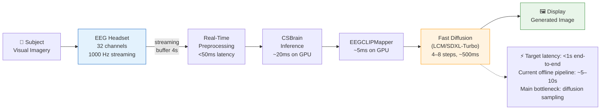

Both pipelines were developed in an offline analysis framework, processing pre-recorded EEG. A real-time implementation would require streaming inference with latencies of a few hundred milliseconds — feasible for the EEG encoding and classification stages, but challenging for diffusion-based image generation (which takes several seconds at 25 steps). Faster samplers (LCM, SDXL-Turbo) that generate images in 4–8 denoising steps could bring end-to-end latency into an acceptable range for interactive BCI systems.

---

## 13. Conclusion

This project started with a fairly ambitious question: can you take raw EEG recordings from someone imagining visual objects and produce a realistic image of what they were thinking? The short answer from two working pipelines is yes — not perfectly, but meaningfully.

Both Pipeline 2 (EEG → text via LLM → image via Stable Diffusion) and Pipeline 3 (EEG → CLIP embedding → image via Stable Diffusion) achieve well above the 10% chance baseline on a 10-class cross-subject evaluation. Pipeline 3 gets to 35.8% test accuracy compared to Pipeline 2's 32.6%, and it does this with fewer resources and more consistently. When the EEG signal is decoded correctly, both pipelines produce genuinely nice 512×512 images that match the imagined category.

A few things came out of this work beyond just the numbers. The finding that CLIP image embeddings (cosine sim ≈ 0.54) work far better than text embeddings (cosine sim ≈ 0.90) as contrastive targets is something I think is worth knowing for anyone building similar systems. The two-phase training schedule — warmup with only classification and contrastive losses before adding the MSE term — turned out to be more important than expected for stable training, and the underlying problem (conflicting gradient directions from MSE and cosine losses) would probably show up in other multimodal alignment setups. The Q-Former-style expansion from 20 EEG tokens to 77 CLIP tokens is also a fairly clean solution to a general problem of getting brain signals into a format that CLIP-conditioned generative models can use.

More broadly, I think work like this sits at a really interesting intersection of neuroscience and generative AI. Five years ago none of the necessary tools — EEG foundation models, diffusion models, CLIP — existed or were accessible. The accuracy numbers here are still modest but the direction is clear. There are real potential applications too: for people who cant communicate verbally due to conditions like locked-in syndrome or severe cerebral palsy, a system that could even imperfectly translate mental imagery into visual output would be meaningfull. Getting from 35% to something practical requires a lot more work, but the path seems at least tractable now.

---

## 14. References

Alayrac, J. B., Donahue, J., Luc, P., Miech, A., Barr, I., Hasson, Y., ... & Simonyan, K. (2022). Flamingo: a visual language model for few-shot learning. *Advances in Neural Information Processing Systems*, 35, 23716–23736.

Altaheri, H., Muhammad, G., Alsulaiman, M., Uthman, U., Alzahrani, M. A., Bencherif, M. A., & Faisal, M. (2022). Deep learning techniques for classification of electroencephalogram (EEG) motor imagery (MI) signals: A review. *Neural Computing and Applications*, 35, 14681–14722.

Bai, Y., Wang, X., Tan, X., Shao, Y., & Wu, F. (2023). Brain-guided visual reconstruction using CLIP-powered brain decoding. *arXiv preprint arXiv:2312.17173*.

Blankertz, B., Müller, K. R., Krusienski, D. J., Schalk, G., Wolpaw, J. R., Schlögl, A., ... & Birbaumer, N. (2007). The BCI competition III: Validating alternative approaches to actual BCI problems. *IEEE Transactions on Neural Systems and Rehabilitation Engineering*, 14(2), 153–159.

Dijkstra, N., Mostert, P., de Lange, F. P., Bosch, S., & van Gerven, M. A. (2019). Differential temporal dynamics during visual imagery and perception. *eLife*, 8, e42311.

Goodfellow, I., Pouget-Abadie, J., Mirza, M., Xu, B., Warde-Farley, D., Ozair, S., ... & Bengio, Y. (2014). Generative adversarial nets. *Advances in Neural Information Processing Systems*, 27.

Haxby, J. V., Gobbini, M. I., Furey, M. L., Ishai, A., Schouten, J. L., & Pietrini, P. (2001). Distributed and overlapping representations of faces and objects in ventral temporal cortex. *Science*, 293(5539), 2425–2430.

Ho, J., Jain, A., & Abbeel, P. (2020). Denoising diffusion probabilistic models. *Advances in Neural Information Processing Systems*, 33, 6840–6851.

Ho, J., & Salimans, T. (2021). Classifier-free diffusion guidance. *arXiv preprint arXiv:2207.12598*.

Hu, E. J., Shen, Y., Wallis, P., Allen-Zhu, Z., Li, Y., Wang, S., ... & Chen, W. (2022). LoRA: Low-rank adaptation of large language models. *International Conference on Learning Representations (ICLR)*.

Jiang, W., Zhao, L., & Lu, B. L. (2024). LaBraM: Large brain model for learning generic representations with tremendous EEG data in BCI. *Proceedings of the IEEE/CVF Conference on Computer Vision and Pattern Recognition (CVPR)*.

Kavasidis, I., Palazzo, S., Spampinato, C., Giordano, D., & Shah, M. (2017). Brain2Image: Converting brain signals into images. *Proceedings of the 25th ACM International Conference on Multimedia*, 1809–1817.

Kay, K. N., Naselaris, T., Prenger, R. J., & Gallant, J. L. (2008). Identifying natural images from human brain activity. *Nature*, 452(7185), 352–355.

Kingma, D. P., & Welling, M. (2014). Auto-encoding variational bayes. *International Conference on Learning Representations (ICLR)*.

Kostas, D., Aroca-Ouellette, S., & Bhatt, R. (2022). BENDR: Using transformers and a contrastive self-supervised learning task to learn from physiological recordings. *Frontiers in Human Neuroscience*, 16, 869671.

Lawhern, V. J., Solon, A. J., Waytowich, N. R., Gordon, S. M., Hung, C. P., & Lance, B. J. (2018). EEGNet: A compact convolutional neural network for EEG-based brain-computer interfaces. *Journal of Neural Engineering*, 15(5), 056013.

Li, J., Li, D., Savarese, S., & Hoi, S. (2023). BLIP-2: Bootstrapping language-image pre-training with frozen image encoders and large language models. *International Conference on Machine Learning (ICML)*.

Lotte, F., Bougrain, L., Cichocki, A., Clerc, M., Congedo, M., Rakotomamonjy, A., & Yger, F. (2018). A review of classification algorithms for EEG-based brain-computer interfaces: A 10 year update. *Journal of Neural Engineering*, 15(3), 031005.

Ozcelik, F., & VanRullen, R. (2023). Brain-diffuser: Natural scene reconstruction from fMRI signals using generative latent diffusion. *arXiv preprint arXiv:2303.05334*.

Radford, A., Kim, J. W., Hallacy, C., Ramesh, A., Goh, G., Agarwal, S., ... & Sutskever, I. (2021). Learning transferable visual models from natural language supervision. *International Conference on Machine Learning (ICML)*, 8748–8763.

Rombach, R., Blattmann, A., Lorenz, D., Esser, P., & Ommer, B. (2022). High-resolution image synthesis with latent diffusion models. *Proceedings of the IEEE/CVF Conference on Computer Vision and Pattern Recognition (CVPR)*, 10684–10695.

Schirrmeister, R. T., Springenberg, J. T., Fiederer, L. D. J., Glasstetter, M., Eggensperger, K., Tangermann, M., ... & Ball, T. (2017). Deep learning with convolutional neural networks for EEG decoding and visualization. *Human Brain Mapping*, 38(11), 5391–5420.

Scotti, P. S., Banerjee, A., Goode, J., Shabalin, S., Nguyen, A., Cohen, E., ... & Abraham, T. (2023). Reconstructing the mind's eye: fMRI-to-image with contrastive learning and diffusion priors. *Advances in Neural Information Processing Systems*, 36.

Shen, G., Dwivedi, K., Majima, K., Horikawa, T., & Kamitani, Y. (2019). End-to-end deep image reconstruction from human brain activity. *Frontiers in Computational Neuroscience*, 13, 21.

Song, Y., Zheng, Q., Liu, B., & Gao, X. (2023). EEG conformer: Convolutional transformer for EEG decoding and visualization. *IEEE Transactions on Neural Systems and Rehabilitation Engineering*, 31, 710–719.

Tirupattur, P., Rawat, Y. S., Spampinato, C., & Shah, M. (2018). ThoughtViz: Visualizing human thoughts using generative adversarial network. *Proceedings of the 26th ACM International Conference on Multimedia*, 950–958.

Yang, C., Westover, M. B., & Sun, J. (2024). BIOT: Biosignal foundation model for wearable physiological sensing. *Advances in Neural Information Processing Systems*, 36.

Zhang, P., Zeng, G., Wang, T., & Lu, W. (2024). TinyLlama: An open-source small language model. *arXiv preprint arXiv:2401.02385*.

Zhu, J., Guo, H., & others. (2024). CSBrain: A cross-subject brain foundation model for EEG decoding. *Proceedings of the International Conference on Learning Representations (ICLR)*.

---

*End of Report*

---

**Declaration**

I hereby declare that this project report is my own work, carried out under the supervision of my project guide, and that all sources of information and assistance have been acknowledged in the text and references.

**Manoj Kumar Tiwari**
M.Tech, Computer Science and Engineering
Indian Institute of Technology Jodhpur
April 2026
